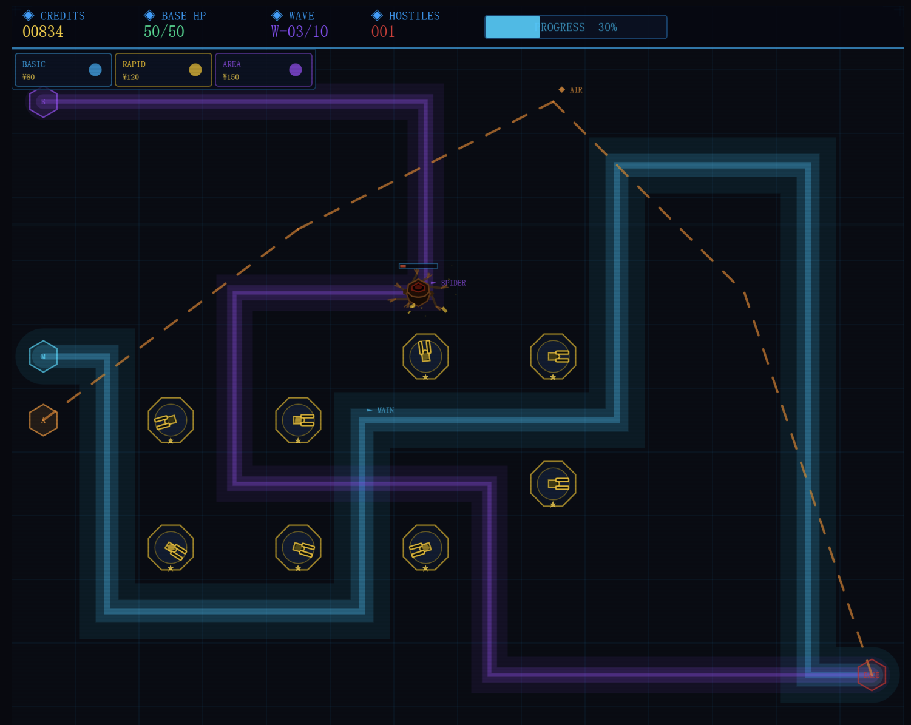
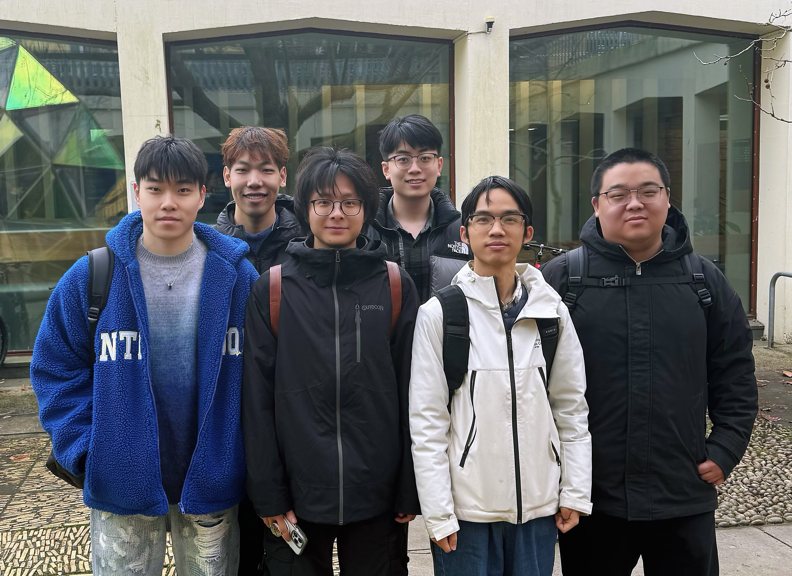

# Quantum Drop — Number Defense

> Course Project | p5.js 2D Web Game

---

## Overview

*Quantum Drop* is a 2D web game combining **tower defense strategy** with a **math-based ball-drop minigame**.  
Before each wave, players earn coins through the minigame, then spend them to build and upgrade towers to fend off enemies.  
The game features **5 levels**, each with a unique map layout, path design, and visual theme, with increasing difficulty.

### STRAPLINE
Defense Protocol — Strong sci-fi identity; high-tech appeal.

### IMAGE
[](https://uob-comsm0166.github.io/2026-group-23/Game_v1.3/)

### LINK
- [game_v0.3](https://uob-comsm0166.github.io/2026-group-23/Game_v0.3/)
- [game_v1.4](https://uob-comsm0166.github.io/2026-group-23/Game_v1.4/)
- [game_v2.1](https://uob-comsm0166.github.io/2026-group-23/Game_v2.1/)

VIDEO. Include a demo video of your game here (you don't have to wait until the end, you can insert a work in progress video)

## Your Group



| username | name | email | role |
|---------|---------|----------|----|
| bruce5800| Zhuolun Li| nu25406@bristol.ac.uk| role|
| zhangxun88| Xun Zhang|  hg25695@bristol.ac.uk| role|
| Che-L| Bowen Liu| jt25343@bristol.ac.uk| role|
| ZhangZhenyu718| Zhenyu Zhang| pv25243@bristol.ac.uk| role|
| zhuqihao7-tech| Qihao Zhu| iy25847@bristol.ac.uk| role|
| ycy-code| Chengyin Yu| si25962@bristol.ac.uk| role|
---

## How to Run

### Requirements
- [Visual Studio Code](https://code.visualstudio.com/)
- VSCode Extension: **Live Server** (search and install from the Extensions Marketplace)

### Steps

1. Open the project folder in VSCode: `File` → `Open Folder`
2. In the file explorer, right-click `index.html`
3. Select `Open with Live Server`
4. Your browser will open automatically at `http://127.0.0.1:5500`

> **Tip:** After editing any file, press `Ctrl+S` to save — the browser reloads automatically.  
> **Debugging:** Press `F12` to open DevTools; check the `Console` tab for errors.  
> **Quick Test:** Click the `DEV: ALL LEVELS` button in the bottom-right of the launch screen to unlock all levels instantly.  
> **Perf HUD:** Press `F` in-game to toggle a bottom-left performance overlay (FPS / entity counts / current phase).  
> **Debug Codex:** Open `codex.html` (right-click → Open with Live Server) for a live grid preview of every monster + tower. Switch path shape (square / circle / fig-8 / horizontal / vertical) to inspect direction-aware sprite work — heading-vector overlay, trail toggle and speed slider included.

---

## Running the Unit Tests

The **game** has zero build toolchain — but we ship a small unit test suite
for the pure-data configs and pure-logic helpers (`data/*.js`, `i18n.js`,
`map/map-core.js`). Tests use Node's built-in `node:test` — **no npm install
needed**.

### Requirements
- Node.js ≥ 18 (ships with `node:test` and `node:assert` out of the box)

### Steps

```bash
# From the repo root
npm test
```

or equivalently:

```bash
node --test tests/*.test.js
```

### What's Covered (48 tests, ~80 ms total)

| File | Scope |
|---|---|
| `tests/i18n.test.js` | `t(key)` lookup, `{0}`/`{1}` param substitution, zh→en→key fallback chain, `setLang()` persistence |
| `tests/data-towers.test.js` | 8 towers × 3 tiers schema, monotonic dmg / range / fireRate progression, MAGNET slowFactor, CANNON blast radius, anti-air flags |
| `tests/data-waves.test.js` | 5 levels × expected wave counts, spawn spec shape `[type, count, interval, delay]`, monster-type whitelist, boss singleton `interval=9999` convention, difficulty ramp |
| `tests/data-levels.test.js` | `LEVEL_INFO` ↔ `LEVEL_NODES` consistency, threat tier = level number, start-coins monotonically decrease |
| `tests/map-core.test.js` | `pathToPixels()` geometry, `isCellBuildable()` — out-of-bounds / HUD row / path cells / tower occupation / level switching |

### How It Works (for curious readers)

Source files in `docs/Game_v2.1/` are plain `<script>` tags meant for a
browser — they have no `module.exports` and they depend on p5.js globals
(`color`, `lerp`, `floor`, ...) and on browser objects (`localStorage`).

`tests/helpers/load.js` builds a Node `vm.createContext` sandbox that:
1. Fakes just enough of p5 (math helpers + drawing no-ops) and the
   browser (`localStorage`, `document`) for our data / logic modules to
   initialise without crashing.
2. Concatenates the requested source files and runs them once in that
   sandbox — the same way a browser loads sequential script tags.
3. Appends a small epilogue that copies known top-level `const` /
   `let` bindings onto `globalThis`, so tests can reach them via
   `ctx.TOWER_DEFS`, `ctx.t(...)`, `ctx.isCellBuildable(...)`.

No source file is modified — the browser game and the tests both read
the same unchanged files.

---

## Game Flow

```
Launch Screen
  → Difficulty Select  [EASY / DIFFICULT]
    → Level Map        [Choose Level 1–5]
      → Gameplay
          Ball-drop Minigame → Build Phase → Combat → Next Wave...
      → End Panel  [Victory / Defeat]
          → RETRY / STAGES / NEXT LEVEL
```

---

## File Structure

> **v2.0 Refactor Note:** v2.0 restructures the v1.4 codebase by (1) extracting pure data into `data/`, (2) centralizing global mutable state into `state.js`, (3) splitting the god-classes `monsters.js` / `towers.js` / `ui.js` into per-concern directories, and (4) adding a first-run tutorial plus a repositioned level-description card on the level-select map. No gameplay behavior changed.

```
project/
├── index.html                   # Entry point — controls script load order (do not reorder)
├── sketch.js                    # p5 skeleton: setup(), draw() phase router, mousePressed router, initGame()
├── state.js                     # Centralized global mutable state (gamePhase, coins, manager, UI flags, ...)
│
├── data/                        # Pure data tables (no logic)
│   ├── towers.js                # TOWER_DEFS — per-tower stats and upgrade levels
│   ├── waves.js                 # WAVE_CONFIGS / WAVE_CONFIG — all 5 levels' wave schedules
│   └── levels.js                # LEVEL_INFO, LEVEL_NODES — level metadata + map node positions
│
├── map/
│   ├── map-core.js              # Path definitions (5 levels), cell validation, drawPaths, shared utils
│   ├── map-lv1.js               # Level 1 background: Grassland
│   ├── map-lv2.js               # Level 2 background: Nebula Ice Fields
│   ├── map-lv3.js               # Level 3 background: Inferno Core
│   ├── map-lv4.js               # Level 4 background: Void Maze
│   └── map-lv5.js               # Level 5 background: Scorched Ruins
│
├── monsters/                    # (split from v1.4 monsters.js)
│   ├── core.js                  # Path utils, particle system, Monster base class
│   ├── mobs/
│   │   ├── snake.js             # MechSnake
│   │   ├── spider.js            # MechSpider
│   │   ├── robot.js             # MechRobot
│   │   ├── phoenix.js           # MechPhoenix
│   │   ├── tank.js              # MechTank
│   │   └── ghostbird.js         # GhostBird
│   ├── bosses/
│   │   ├── fission.js           # Boss① Fission Core (+ FissionCore split)
│   │   ├── phantom.js           # Boss② Phantom Protocol
│   │   ├── antmech.js           # Boss③ Ant-Mech
│   │   └── carrier.js           # Steel Carrier
│   └── manager.js               # MonsterManager
│
├── towers/                      # (split from v1.4 towers.js, using prototype extension)
│   ├── base.js                  # Tower base class (construct / upgrade / schedule)
│   ├── variants/                # Per-type behaviors injected on Tower.prototype
│   │   ├── rapid.js             #   RAPID
│   │   ├── laser.js             #   LASER
│   │   ├── nova.js              #   NOVA
│   │   ├── chain.js             #   CHAIN
│   │   ├── magnet.js            #   MAGNET
│   │   ├── ghost.js             #   GHOST
│   │   ├── scatter.js           #   SCATTER
│   │   └── cannon.js            #   CANNON (rail cannon, manual aim)
│   ├── projectile.js            # Projectile class
│   ├── effects.js               # Chain arcs / cannon blasts / mortar visuals
│   └── manager.js               # towers[] / projectiles[] + updateAndDrawTowers
│
├── home-tower.js                # HomeTower (end-of-path base)
├── waves.js                     # Wave state machine (configs now live in data/waves.js)
├── minigame.js                  # Ball-drop minigame (fully implemented)
│
├── ui/                          # (split from v1.4 ui.js)
│   ├── common.js                # UI constants, HUD cache, utils, click effects
│   ├── hud.js                   # Top HUD bar
│   ├── pause.js                 # Pause button + menu
│   ├── wave-ui.js               # Wave countdown / wave-end panel / victory hint
│   ├── build-menu.js            # Bottom build menu + tooltip
│   ├── tower-panel.js           # Tower upgrade / demolish panel
│   ├── placement.js             # Placement preview + battlefield click router
│   └── index.js                 # drawUI / initUI dispatcher
│
├── screens/
│   ├── launch-screen.js         # Launch screen + DEV test entry
│   ├── difficulty-select.js     # Difficulty selection screen
│   ├── level-map.js             # Level selection map (hover card anchored next to each node)
│   └── end-panel.js             # End panel (victory / defeat)
│
├── tutorial.js                  # First-run tutorial overlay (Level 1 only, persists via localStorage)
│
└── assert/
    └── *.png                    # Static assets (launch screen background, etc.)
```

> **Important:** The script load order in `index.html` must not be changed — later files depend on earlier ones.

---

## Team & Completion Status

| Module | Files | Member | Status |
|--------|-------|--------|--------|
| Monster & Path System | `monsters.js` `waves.js` `map/map-core.js` (paths) | Zhang Xun | ✅ Done |
| Map Layout & Tower Placement | `towers.js` `map/map-core.js` (cell logic) `ui.js` (menus/panels) | Liu Bowen | ✅ Done |
| Ball-drop Minigame | `minigame.js` | Yu Chengyin + Zhu Qihao | ✅ Done |
| Tower Combat Logic | `towers/` | Zhang Zhenyu | ✅ Done |
| UI & State Integration | `ui/` `screens/` `state.js` | Li Zhuolun | ✅ Done |
| v2.0 Refactor + Tutorial | `data/` `state.js` `monsters/` `towers/` `ui/` `tutorial.js` | Li Zhuolun | ✅ Done |

---

## Level Overview

| Level | Name | Theme | Waves | Starting Coins | Notes |
|-------|------|-------|-------|----------------|-------|
| 1 | SECTOR ALPHA | Grassland | 6 | ¥2000 | Beginner — simple paths, infantry-focused |
| 2 | NEBULA RIFT | Ice Nebula | 7 | ¥1800 | Dual-lane, aerial enemies introduced |
| 3 | IRON CITADEL | Inferno | 8 | ¥1600 | Complex terrain, armored enemies and first Boss |
| 4 | VOID MAZE | Void | 9 | ¥1400 | Winding paths, high-speed enemy waves |
| 5 | OMEGA GATE | Scorched Ruins | 10 | ¥1200 | Final level — elite forces + all three Bosses |

> EASY mode: starting coins ×1.3, base HP = 30.  
> DIFFICULT mode: coins as listed, base HP = 20.

---

## Tower Reference

| Tower | Label | Cost | Description | Max Level |
|-------|-------|------|-------------|-----------|
| Rapid Fire | `RAPID` | ¥110 | High-frequency single target; ignores Robot shield; 20-charge super-gun mode | Lv3 |
| Laser Cutter | `LASER` | ¥180 | Charges then fires at multiple targets simultaneously (Lv1: 1 → Lv3: 3 targets) | Lv3 |
| Nova Cannon | `NOVA` | ¥200 | Piercing shot through all ground enemies; area explosion on impact | Lv3 |
| Chain Arc | `CHAIN` | ¥160 | Chain lightning (Lv1: 1 jump → Lv3: 3 jumps); ignores Tank barrier | Lv3 |
| Magnet Tower | `MAGNET` | ¥130 | No damage; continuously slows nearby enemies (up to 80% slow at Lv3) | Lv3 |
| Ghost Missile | `GHOST` | ¥190 | Homing missiles (Lv1: 1 → Lv3: 3); near-full-map range | Lv3 |
| Scatter Cannon | `SCATTER` | ¥150 | Shotgun spread targeting aerial units only (Lv1: 3 pellets → Lv3: 7 pellets) | Lv3 |
| Rail Cannon | `CANNON` | ¥220 | Manual-aim rail cannon; massive single-shot damage with long reload | Lv3 |

> Each tower can be upgraded up to **3 times**. Upgrade costs are defined in `towers.js` under each tower's `levels` array.  
> Demolishing a tower refunds **80%** of its original build cost.

---

## Enemy Reference

| Enemy | Lane | Special Ability |
|-------|------|----------------|
| Mech Snake | Main | Group heal every 900 frames |
| Mech Spider | Edge | Periodic dash (3.5× speed for 20 frames) |
| Armored Tank | Main | Barrier shield — only Chain Arc can pierce it |
| Robot | Main | Shield triggered at 60% HP — Rapid Fire ignores it |
| Mech Phoenix | Air | Jamming pulse — disables all towers for 90 frames |
| Ghost Bird | Air | High-speed flyer — only anti-air towers can target it |
| Steel Carrier | Main | Massive HP, very slow |
| Boss① Fission Core | Main | Overload burst; splits into 4 Mech Snakes at 50% HP |
| Boss② Phantom Protocol | Main | Quantum dodge every 3 hits; EMP disables all towers; spawns 2 clones at 30% HP |
| Boss③ Ant-Mech | Main | Alternates Giant (−85% dmg taken) ↔ Tiny (×2.2 dmg taken); Berserk mode at 50% HP |

---

## Ball-Drop Minigame

Triggered automatically before each wave:

1. **Aim Phase** — Move your mouse to select a launch X position, then click to confirm
2. **Drop Phase** — Balls fall under gravity and pass through **gates** that modify their count:
   - `+N` gate: adds N balls
   - `−N` gate: removes N balls
   - `×N` gate: multiplies ball count by N
3. **Settlement Phase** — Final ball count is converted into coins for the upcoming wave

---

## Key API Reference

### Coins
```js
coins += n;   // Gain coins
coins -= n;   // Spend coins (always check coins >= cost first)
```

### Monster Manager
```js
manager.monsters                                      // Array of all active monsters
manager.getMonstersInRange(cx, cy, range, antiAir)    // Get monsters within range
manager.damageAt(x, y, dmg, antiAir, fromSide)        // Point damage
manager.damageInRadius(cx, cy, radius, dmg, antiAir)  // Area-of-effect damage
```

### Map & Cell Validation
```js
isCellBuildable(gx, gy)   // Returns false if cell is on a path, in HUD area, or already has a tower
initMap()                  // Load path and background for currentLevel
```

### Game Phase Transitions
```js
// Always call initGame() when switching to 'playing'
gamePhase = 'playing';
initGame();   // Initializes a new game session based on currentLevel and gameDifficulty
```

### Jam System
```js
jammedUntilFrame = frameCount + duration;  // Disable all towers for [duration] frames
```

---

## Global Variables Quick Reference (defined in `state.js`, v2.0)

| Variable | Description | Default |
|----------|-------------|---------|
| `CELL_SIZE` | Pixels per grid cell | `70` |
| `GRID_COLS / GRID_ROWS` | Map dimensions (columns / rows) | `14 / 12` |
| `HUD_HEIGHT` | Top HUD bar height (px) | `46` |
| `coins` | Current coins | Set by level + difficulty |
| `baseHp / baseHpMax` | Current / max base HP | EASY: 30, DIFFICULT: 20 |
| `waveNum / TOTAL_WAVES` | Current wave / total waves | Depends on level (6–10) |
| `COUNTDOWN_FRAMES` | Frames between waves | `300` (5 seconds) |
| `currentLevel` | Active level number (1–5) | `1` |
| `unlockedLevel` | Highest unlocked level | `1` |
| `gameDifficulty` | Selected difficulty | `'easy'` / `'difficult'` |
| `gamePhase` | Current game phase | `'launch'` |
| `jammedUntilFrame` | Frame at which jam effect ends | `0` |
| `tutorialActive` / `tutorialStep` | First-run Level-1 tutorial overlay state | `false` / `0` |
