<div align="center">


<br>

# Quantum Drop

<p>
  
  
  
  
  
</p>

<br>


<br><br>


<br><br>

> *"A 2-D browser game that fuses tower-defence with a Plinko-style ball-drop economy."*
>
> *COMSM0166 — Software Engineering Discipline & Practice · Group 23 · 2025-26*

<br>

[](https://uob-comsm0166.github.io/2026-group-23/Game_v2.1/)
[](video/我的影片.mp4)
[](video/Quantum_Drop_Group23.pptx)
[](DESIGN.md)

<br>


</div>

<br>

<a name="group-members"></a>
<h2 align="center">Group Members</h2>

<div align="center">

| GitHub | Name | Email | Primary role | Cross-cutting |
|:---:|:---:|:---:|:---|:---|
| [@ycy-code](https://github.com/ycy-code) | Yu Chengyin | si25962@bristol.ac.uk | Mini-game physics — ball motion, collisions, settlement | Audio integration, launch / end screen polish |
| [@zhuqihao7-tech](https://github.com/zhuqihao7-tech) | Zhu Qihao | iy25847@bristol.ac.uk | Mini-game gate layout — random generation, payout math | Level economy tuning (`data/levels.js`) |
| [@ZhangZhenyu718](https://github.com/ZhangZhenyu718) | Zhang Zhenyu | pv25243@bristol.ac.uk | Tower combat — attack, skills, projectile management | Performance profiling (perf HUD, CANNON optimisation) |
| [@zhangxun88](https://github.com/zhangxun88) | Zhang Xun | hg25695@bristol.ac.uk | Monsters & path system — spawn, movement, wave control | Boss AI, wave-data balancing |
| [@Che-L](https://github.com/Che-L) | Liu Bowen | jt25343@bristol.ac.uk | Map layout & tower placement — cell logic, placement | HUD/tooltip/wave-preview caches, `pathCellSet` |
| [@bruce5800](https://github.com/bruce5800) | Li Zhuolun | nu25406@bristol.ac.uk | UI & state integration — `ui/`, `screens/`, `state.js` | v2.0 refactor coordination, tutorial, i18n, test harness |

</div>

<br>

<p align="center">
  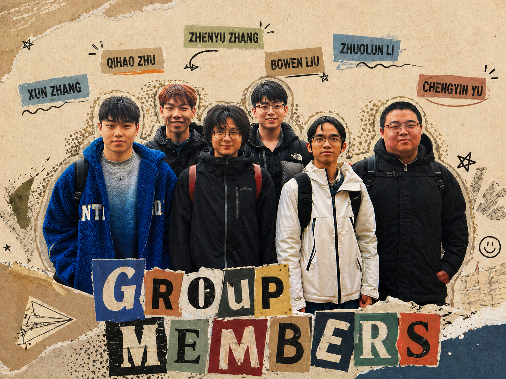
  <br>
  <sub><i>Group 23 — six contributors, one shared canvas, zero hand-drawn sprites.</i></sub>
</p>

Roles settled in week 5 (`workshop/week05/LabourDivision.md`) and stayed stable through the rest of the project. We avoided "everybody does a bit of everything" because with six people it produces chaos; instead each module had a single clear owner and at least one reviewer.

<br>


<br>

<a name="repository-structure"></a>
<h2 align="center">Repository Structure</h2>

```text
2026-group-23/
├── README.md                ← You are here — the project report
├── REPORT.md                ← Mirror of this README's report section
├── DESIGN.md                ← Companion document on key design decisions
├── LICENSE                  ← MIT
├── docs/
│   ├── Game_v0.3/           ← Legacy build
│   ├── Game_v1.3/           ← Legacy build
│   ├── Game_v1.4/           ← Legacy build (pre-refactor)
│   ├── Game_v2.1/           ← Current shipping build (entry: index.html)
│   ├── screenshots/         ← Screenshots and gifs used in this README
│   └── visual-identity.md   ← Single source of truth for colours / badges / Mermaid theme
├── tests/                   ← 48 node:test cases (zero-install)
├── video/                   ← Demo video, slides, speaker scripts
├── workshop/                ← Weekly artefacts (week01 … week10)
└── ArtAsset/                ← Shared art assets (e.g. the README divider banner)
```

> **Older builds** are still served from GitHub Pages: [v0.3](https://uob-comsm0166.github.io/2026-group-23/Game_v0.3/) · [v1.4](https://uob-comsm0166.github.io/2026-group-23/Game_v1.4/) · [v2.1 (latest)](https://uob-comsm0166.github.io/2026-group-23/Game_v2.1/). Detailed source-tree of `docs/Game_v2.1/`, the script-load-order rule, and the testable globals all live in **[Appendix A · Build & Test](#a-build--test-developers)**.
>
> **Other materials.** [`video/我的影片.mp4`](video/我的影片.mp4) · [`video/Quantum_Drop_Group23.pptx`](video/Quantum_Drop_Group23.pptx) · [`video/Quantum_Drop_Speaker_Scripts.pdf`](video/Quantum_Drop_Speaker_Scripts.pdf)

<br>


<br>

<a name="table-of-contents"></a>
<h2 align="center">Table of Contents</h2>

<div align="center">

| # | Section | Description |
|:---:|:---|:---|
| **01** | [Introduction](#1-introduction) | What Quantum Drop is, what it's based on, what makes it novel |
| **02** | [Requirements](#2-requirements) | Ideation, stakeholders, user stories, MoSCoW, epics |
| **03** | [Design](#3-design) | Architecture, state machine, class diagram, UX, audio |
| **04** | [Implementation](#4-implementation) | Three biggest technical challenges |
| **05** | [Evaluation](#5-evaluation) | Heuristic walkthrough, playtests, perf, unit tests |
| **06** | [Process](#6-process) | Tools, cadence, what went wrong, what worked |
| **07** | [Sustainability, Ethics & Accessibility](#7-sustainability-ethics--accessibility) | SusAF — environmental, individual, technical, ethics |
| **08** | [Conclusion](#8-conclusion) | Lessons learnt, challenges, future work |
| **09** | [Contribution Statement](#9-contribution-statement) | Per-person commit-trail across the term |
| **10** | [AI Usage Statement](#10-ai-usage-statement) | Where AI tools were and weren't used |
| **A** | [Build & Test](#a-build--test-developers) | Run the game, run the unit tests, source tree, APIs |
| **B** | [Acknowledgements](#b-acknowledgements) | Course staff, playtesters, license |

</div>

<br>


<br>

<a name="1-introduction"></a>
<h2 align="center">1. Introduction</h2>

### 1.1 Concept

**Quantum Drop** is a 2-D browser game that fuses the slow, strategic layer of a **tower-defence** with the fast, tactile feel of a **ball-drop minigame**. It is written entirely in [p5.js](https://p5js.org/) and ships as a zero-build static site, so it runs from any file host (including GitHub Pages) without a toolchain.

The player works their way through five themed sectors — *Sector Alpha*, *Nebula Rift*, *Iron Citadel*, *Void Maze* and *Omega Gate* — each with its own map, monster roster, and a tightening starting budget (in-game credits, prefixed `¥`, fall from `¥2000` at Level 1 to `¥1200` at Level 5). Eight tower variants (*Rapid*, *Laser*, *Nova*, *Chain*, *Magnet*, *Ghost*, *Scatter*, *Cannon*), three upgrade tiers each, and ten enemy types (including three multi-phase bosses) give the combat layer meaningful depth.

### 1.2 What makes it novel

The **twist** is in the economy. Most tower-defence games make the player wait passively between waves while resources accumulate on a timer; we replace that dead time with a Plinko-style minigame where the player aims a launcher, watches balls fall through a lattice of `+N`, `−N` and `×N` gates, and the final ball count becomes the coin budget for the next wave. This has two design effects we wanted: the player is *always* engaged (no idle seconds), and the luck–skill mix of the minigame becomes a narrative hook — a great run genuinely changes your tower composition for the wave that follows.

A secondary novelty is that **no art assets were drawn**: every monster, tower, projectile, particle and background is generated procedurally in JS, which enforces a unified cyberpunk aesthetic across six contributors and keeps all visuals in the same git diff as the logic.

### 1.3 The game at a glance

<div align="center">

| Launch screen | Mission select | Mini-game (mid-salvo) |
|:---:|:---:|:---:|
| 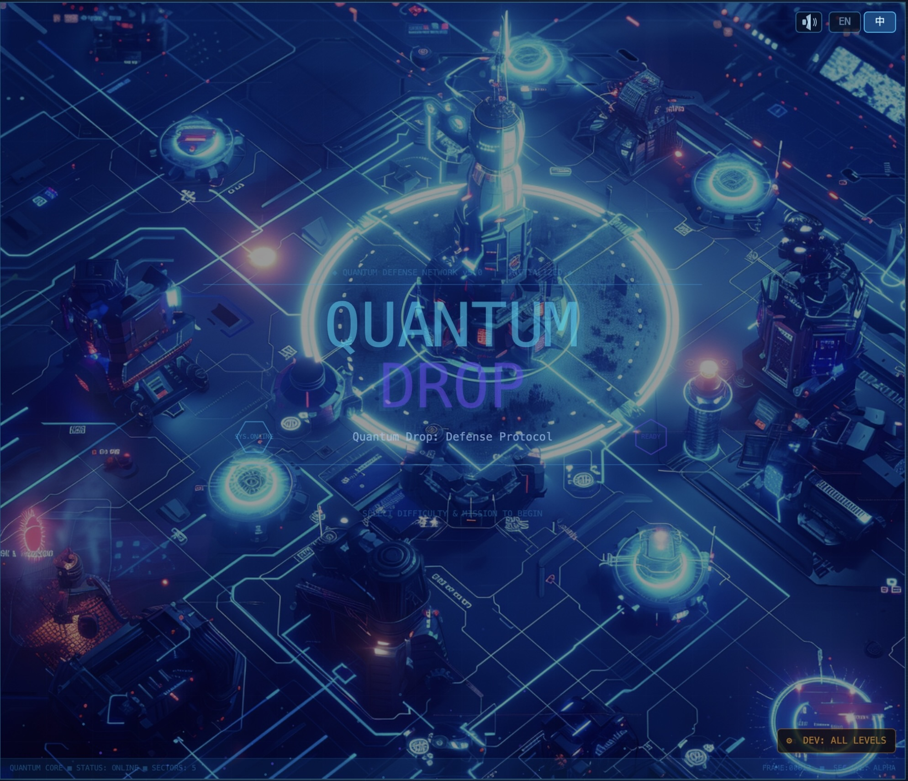 | 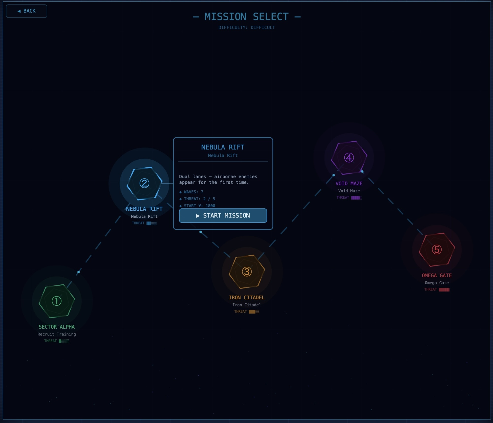 | 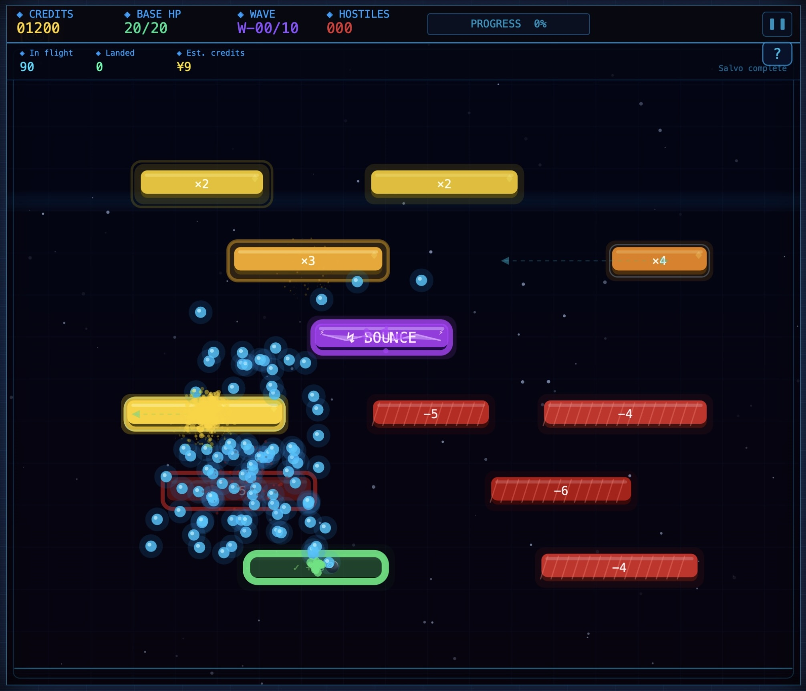 |

| Sector Alpha | Nebula Rift | Iron Citadel | Void Maze | Omega Gate |
|:---:|:---:|:---:|:---:|:---:|
| 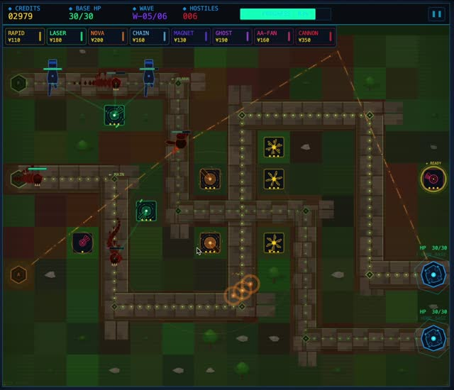 | 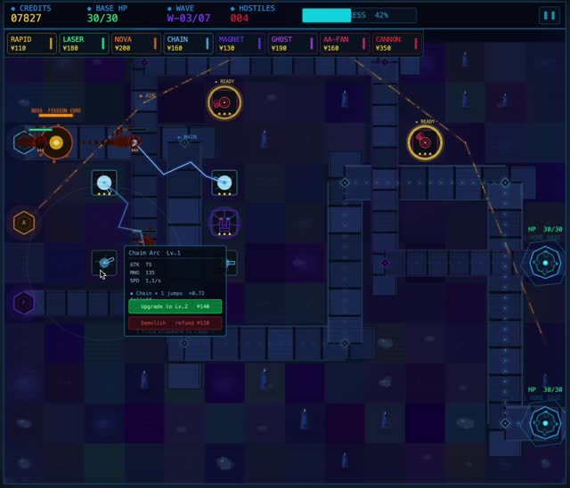 | 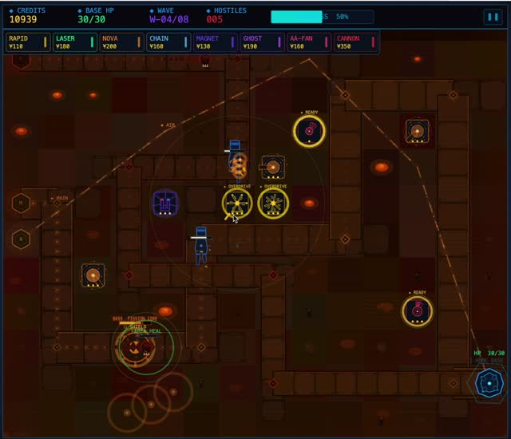 | 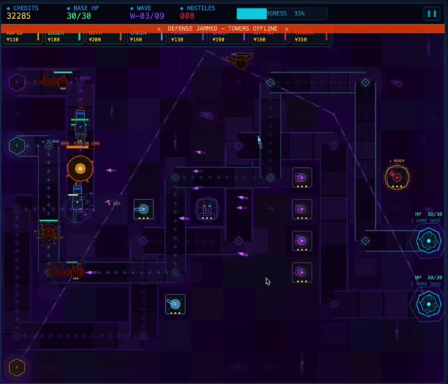 | 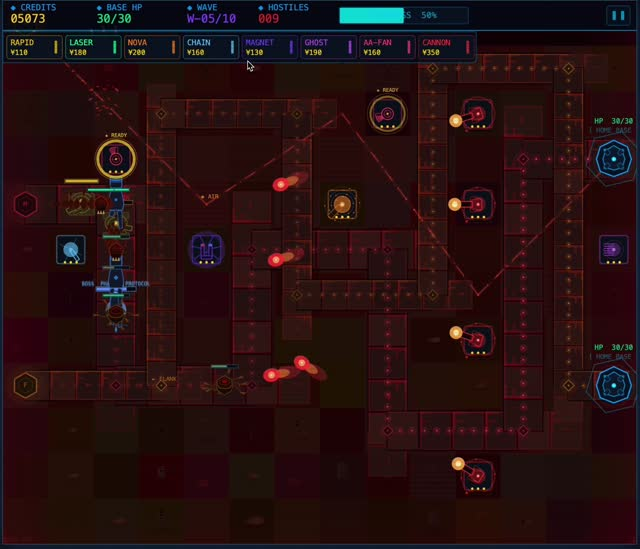 |

</div>

**Game flow**

```
Launch Screen
  → Difficulty Select  [EASY / DIFFICULT]
    → Level Map        [Choose Level 1–5]
      → Gameplay
          Ball-drop Minigame → Build Phase → Combat → Next Wave...
      → End Panel  [Victory / Defeat]
          → RETRY / STAGES / NEXT LEVEL
```

**Levels**

| Level | Name | Theme | Waves | Starting credits | Notes |
|---|---|---|---:|---:|---|
| 1 | SECTOR ALPHA | Grassland | 6 | ¥2000 | Beginner — simple paths, infantry-focused |
| 2 | NEBULA RIFT | Ice Nebula | 7 | ¥1800 | Dual-lane, aerial enemies introduced |
| 3 | IRON CITADEL | Inferno | 8 | ¥1600 | Complex terrain, armoured enemies, first Boss |
| 4 | VOID MAZE | Void | 9 | ¥1400 | Winding paths, high-speed enemy waves |
| 5 | OMEGA GATE | Scorched Ruins | 10 | ¥1200 | Final level — elite forces + all three Bosses |

> EASY: starting credits ×1.3, base HP = 30. DIFFICULT: credits as listed, base HP = 20.

**Towers**

| Tower | Label | Cost | Description | Max Level |
|---|---|---:|---|---:|
| Rapid Fire | `RAPID` | ¥110 | High-frequency single target; ignores Robot shield; 20-charge super-gun mode | Lv3 |
| Laser Cutter | `LASER` | ¥180 | Charges then fires at multiple targets simultaneously (Lv1 → Lv3: 1 → 3 targets) | Lv3 |
| Nova Cannon | `NOVA` | ¥200 | Piercing shot through all ground enemies; area explosion on impact | Lv3 |
| Chain Arc | `CHAIN` | ¥160 | Chain lightning (Lv1 → Lv3: 1 → 3 jumps); ignores Tank barrier | Lv3 |
| Magnet Tower | `MAGNET` | ¥130 | No damage; continuously slows nearby enemies (up to 80 % at Lv3) | Lv3 |
| Ghost Missile | `GHOST` | ¥190 | Homing missiles (Lv1 → Lv3: 1 → 3); near-full-map range | Lv3 |
| Scatter Cannon | `SCATTER` | ¥150 | Shotgun spread targeting aerial units only (Lv1 → Lv3: 3 → 7 pellets) | Lv3 |
| Rail Cannon | `CANNON` | ¥220 | Manual-aim rail cannon; massive single-shot damage with long reload | Lv3 |

> Each tower upgrades up to **3 times**. Demolishing refunds **80 %** of the original build cost.

**Enemies**

| Enemy | Lane | Special ability |
|---|---|---|
| Mech Snake | Main | Group heal every 900 frames |
| Mech Spider | Edge | Periodic dash (3.5× speed for 20 frames) |
| Armoured Tank | Main | Barrier shield — only Chain Arc can pierce |
| Robot | Main | Shield triggers at 60 % HP — Rapid Fire ignores it |
| Mech Phoenix | Air | Jamming pulse — disables all towers for 90 frames |
| Ghost Bird | Air | High-speed flyer — only anti-air towers can target |
| Steel Carrier | Main | Massive HP, very slow |
| Boss① Fission Core | Main | Overload burst; splits into 4 Mech Snakes at 50 % HP |
| Boss② Phantom Protocol | Main | Quantum dodge every 3 hits; EMP disables towers; spawns 2 clones at 30 % HP |
| Boss③ Ant-Mech | Main | Alternates Giant (−85 % dmg taken) ↔ Tiny (×2.2 dmg taken); Berserk at 50 % HP |

**Ball-drop mini-game**

Triggered automatically before each wave:

1. **Aim phase** — move the mouse to choose a launch X, then click to confirm.
2. **Drop phase** — balls fall under gravity through gates that modify their count:
   - `+N` gate adds N balls
   - `−N` gate removes N balls
   - `×N` gate multiplies the count by N
3. **Settlement** — the final ball count is converted into coins for the upcoming wave.

<br>


<br>

<a name="2-requirements"></a>
<h2 align="center">2. Requirements</h2>

### 2.1 Ideation

Week 2 was an open ideation week — each team member brought one concept (a painting app, a rhythm game, a tower defence, a Plinko-style physics toy, a typing trainer, and a puzzle-platformer). We ran a dot-vote over three criteria: *fits a 10-week schedule*, *exposes everyone to non-trivial programming*, and *would be fun to demo*. Each criterion scored **0 – 5** (higher = better); Round-1 results:

<div align="center">

| Concept | Schedule (0–5) | Engineering depth (0–5) | Demo appeal (0–5) | **Total** |
|:---|:---:|:---:|:---:|:---:|
| Tower defence † | 5 | 5 | 1 | **11** |
| Rhythm game † | 3 | 4 | 4 | **11** |
| Plinko physics toy | 5 | 2 | 2 | 9 |
| Puzzle-platformer | 2 | 4 | 3 | 9 |
| Painting app | 4 | 2 | 2 | 8 |
| Typing trainer | 5 | 1 | 1 | 7 |

*Table 1 — Round-1 dot-vote scoring. † = tied at the top. Neither leader dominated all three criteria, so neither won outright.*

</div>

Tower defence won on criteria 1 and 2 but lost on criterion 3 because it felt "done-to-death"; the Plinko prototype lost because it was a one-minute toy with no progression. The proposal that broke the tie was to fuse the two: use the Plinko as the *economy layer* of a tower defence so the player is always interacting, even between waves. Re-scored under the same rubric, the fusion lifted the weakest criterion of each parent without dropping the others:

<div align="center">

| Concept | Schedule | Engineering depth | Demo appeal | **Total** |
|:---|:---:|:---:|:---:|:---:|
| **Quantum Drop** (Tower Defence × Plinko) ★ | **5** | **5** | **4** | **14** |

*Table 2 — The fusion proposal. ★ = selected. Demo appeal lifts from TD's `1` to `4` because the inter-wave Plinko removes the "wait passively for resources" anti-pattern; engineering depth stays at `5` because the fusion adds a real-time physics + gate-lattice layer on top of TD without removing any of TD's combat work.*

</div>

We built two paper prototypes in week 3 — one a classic grid TD to pin down placement feel, the other a Plinko board to pin down drop speed and gate density — and the combined experience felt promising enough to commit to.

### 2.2 Stakeholders

We mapped Quantum Drop's stakeholders onto an Alexander-style **onion model**, then derived our internal team roles from the innermost (operational) ring.

<p align="center">
  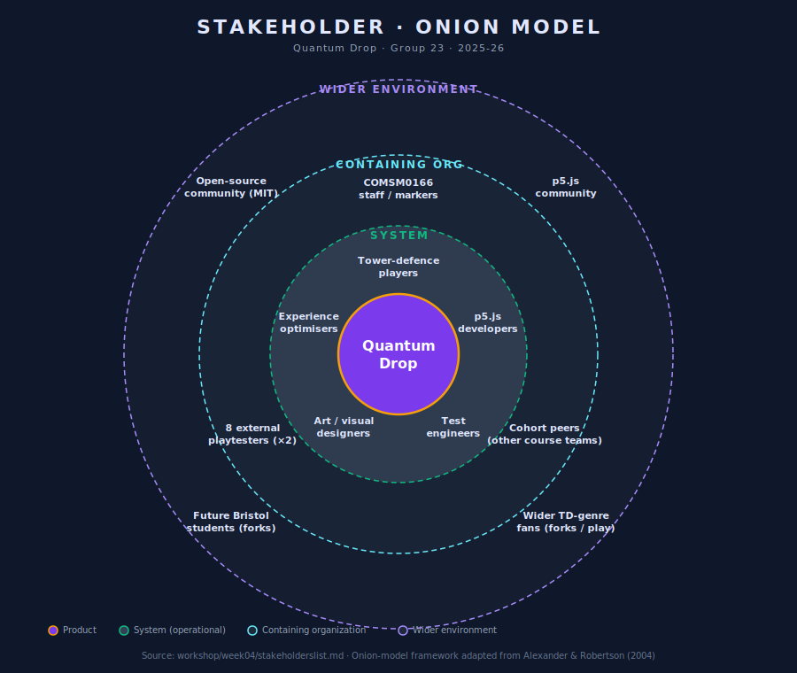
  <br>
  <sub><i>Concentric rings: <b>Product</b> (the game itself) · <b>System</b> (operational stakeholders — the five roles each represented by a team member) · <b>Containing organization</b> (COMSM0166 staff, eight external playtesters, peer teams) · <b>Wider environment</b> (open-source community, p5.js community, future Bristol students, the wider TD-genre audience).</i></sub>
</p>

The **five operational roles** in the inner ring (`workshop/week04/stakeholderslist.md`) are the ones the team had to actively service week to week:

1. **Tower-defence players** — the primary audience; expect clean build menus, visible range indicators and a fair difficulty curve.
2. **p5.js developers (ourselves)** — care about modular files, predictable load order and low iteration cost.
3. **Art / visual designers** — care that visuals stay coherent as features land.
4. **Test engineers** — need deterministic, testable units and reproducible bugs.
5. **Experience optimisers** — watch over readability, onboarding and accessibility.

Each role deliberately overlapped with a team member's own skills, so "who cares about this?" had an obvious answer in every review. The outer rings — **course staff / playtesters / cohort peers** in the containing-organization ring, and the **open-source ecosystem** in the wider environment — fed back into the project less frequently but shaped large decisions: the heuristic walkthrough (see §5.1) was a containing-organization touchpoint, the MIT licence and zero-build deploy were wider-environment commitments.

### 2.3 Use cases & user stories

The canonical stories (Week 4) are:

- *As a player, I want to play a ball-throwing minigame to earn coins, so that I can upgrade my towers.*
  **Acceptance:** when the minigame ends, coins equal to the final ball count are added to my balance.
- *As a player, I want to upgrade my towers using coins, so that I can defend against stronger enemies.*
  **Acceptance:** when I pick an upgrade and have enough coins, the tower's damage and/or range visibly increase and the coin balance decreases by the documented cost.
- *As a game designer, I want the minigame payouts to be balanced, so the tower layer stays challenging.*
  **Acceptance:** on average performance, coin income is sufficient to buy one or two towers per wave but not enough to brute-force the map.

From these three seed stories we derived eighteen secondary ones, each tied to a concrete deliverable. Four representative examples:

- *"As a first-time player I want an onboarding hint so I know what the build menu is."* → the five-step Level-1 tutorial.
- *"As a returning player I want my language and tutorial-seen flag preserved."* → `localStorage` persistence (`qd_lang`, `qd_tutorial_l1_done`).
- *"As a developer I want one-click access to all five levels."* → the `DEV: ALL LEVELS` shortcut on the launch screen.
- *"As a player on a small laptop I don't want the canvas to overflow the viewport."* → responsive CSS scaling via `windowResized()`.

### 2.4 Use-case diagram (informal)

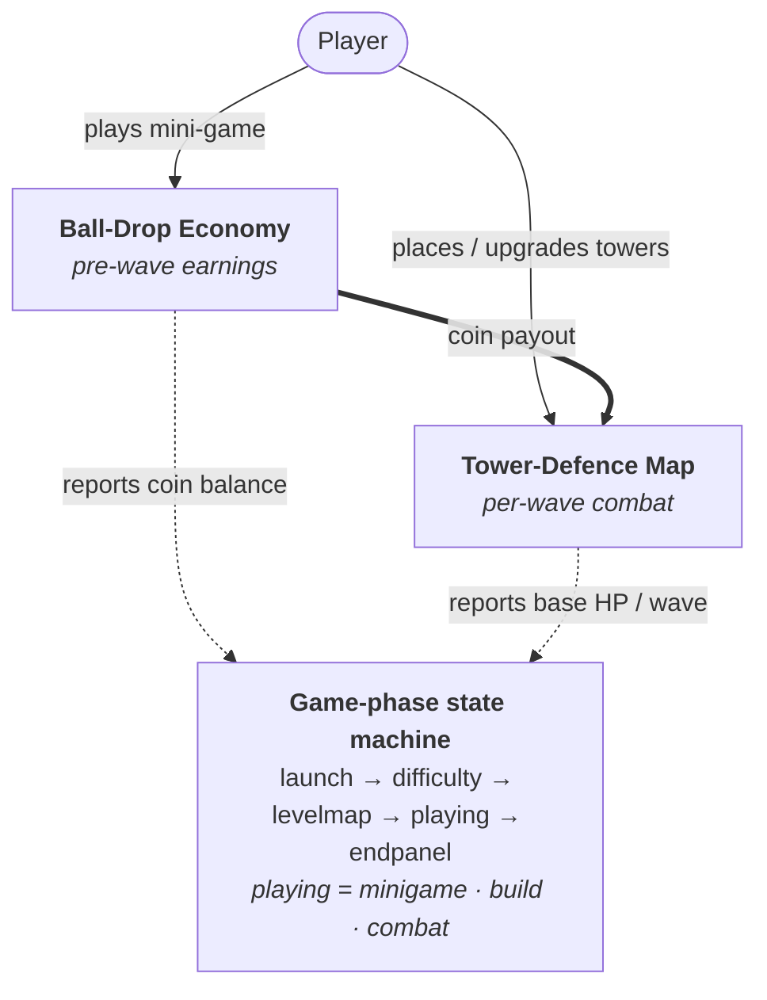

### 2.5 Requirement prioritisation (MoSCoW)

- **Must** — 5 playable levels; aim + drop + settlement minigame loop; at least four tower types; three enemy archetypes; win/lose conditions.
- **Should** — boss encounters; tower upgrade tiers; first-run tutorial; English/中文 toggle; pause menu.
- **Could** — sound; performance HUD; responsive canvas; unit tests; per-level star rating.
- **Won't (this term)** — networked multiplayer, persistent accounts, mobile touch support, sprite-based cutscenes.

Everything in *Must* and *Should* shipped; every *Could* except per-level star rating also shipped (sound, perf HUD toggled by `F`, responsive CSS scaling, and 48 `node:test` cases). *Won't* items are listed as future work.

### 2.6 Development epics

The MoSCoW list scopes *what* we want; the epic table below scopes *how it ships* — each epic is the unit of work behind one or more user stories, with concrete acceptance criteria the team could verify without a marker present.

| Epic | Description | Key acceptance criteria |
|---|---|---|
| **Mini-game economy** | Pre-wave Plinko earns coins | Aim → drop → settlement; coins added 1:1 with final ball count; payouts within ±25 % of design target |
| **Tower combat** | 8 variants × 3 tiers across 5 maps | Place from build menu, target/attack, upgrade/demolish; anti-air rules respected; CANNON manual aim; 80 % refund on demolish |
| **Wave & monster system** | 5 levels × 6–10 waves with bosses | Spawn schedule per level; 10 enemy types; 3 multi-phase bosses; wave-clear bonus credits |
| **HUD & flow** | Live HUD + screens | Coin/HP/wave update every frame; build menu, tower panel, end panel, level map, difficulty select |
| **First-run experience** | Onboarding + bilingual UI | 5-step Level-1 tutorial; BALLS → COINS settlement card; EN / 中文 toggle persisted in `localStorage` |
| **Performance** | Stable frame rate under load | 60 FPS for ordinary play; ≥ 50 FPS in worst-case (Level 5 + Boss 3 Berserk + ≥ 5-cannon volley) |

<br>


<br>

<a name="3-design"></a>
<h2 align="center">3. Design</h2>

### 3.1 System architecture

The shipping version is **v2.1** (sound, perf HUD, responsive canvas, 48 unit tests on top of v2.0's structural refactor). The game runs as a single p5.js sketch — all source files live in one global scope and are loaded in a fixed order by `index.html`, which is the single source of truth for dependency order. The codebase is laid out by *concern*, not by *file type*:

```
docs/Game_v2.1/
├── index.html          # script load order
├── sketch.js           # p5 entry: setup(), draw(), phase router, keyPressed
├── state.js            # every mutable global, in one declaration file
├── audio.js            # HTMLAudio wrapper + mute toggle
├── data/               # pure config: TOWER_DEFS, WAVE_CONFIGS, LEVEL_INFO
├── map/                # path definitions + per-level backgrounds
├── monsters/           # base + mobs/* + bosses/* + manager
├── towers/             # base + variants/* (prototype-injected) + manager
├── ui/                 # hud + pause + build-menu + tower-panel + placement
├── screens/            # launch + difficulty + level-map + end-panel
├── minigame.js         # ball-drop economy
├── waves.js            # wave state machine
└── tutorial.js         # first-run overlay
```

### 3.2 State machine

At runtime the game is a **phase state machine** driven from `sketch.js::draw()`:

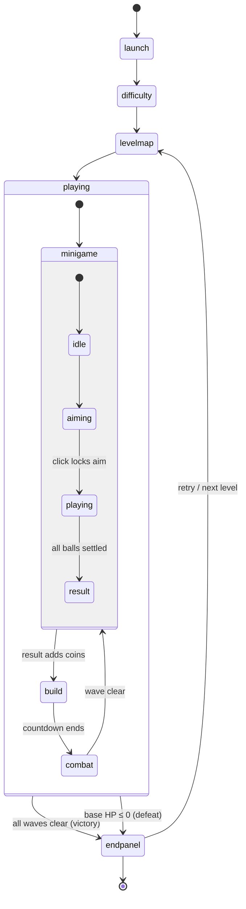

> *State names match the literal string values of `gamePhase` (`'launch'`, `'difficulty'`, `'levelmap'`, `'playing'`, `'endpanel'`) and `minigameState` (`'idle'`, `'aiming'`, `'playing'`, `'result'`). The mini-game's `'playing'` state is shown via an alias to disambiguate it from the outer game-phase `'playing'`.*

<p align="center">
  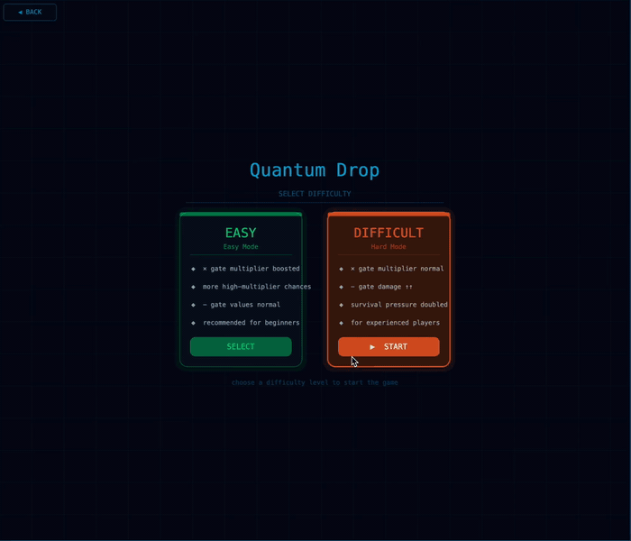
  <br>
  <sub><i>Mission-select carousel — the canvas-based pseudo-3D level chooser. Hover-tilted level nodes anchor each description card with a connecting line, removing the "which level is this describing?" ambiguity that the v1.4 sidebar had.</i></sub>
</p>

### 3.3 Sequence diagram (one wave cycle)

The state machine in §3.2 captures *which states* the game can be in; this sequence diagram captures *what happens during one wave* — from the moment the player locks aim in the minigame to the moment the wave clears and the next minigame begins. It traces every cross-module call on the hot path, and is the single most useful diagram when onboarding a new contributor.

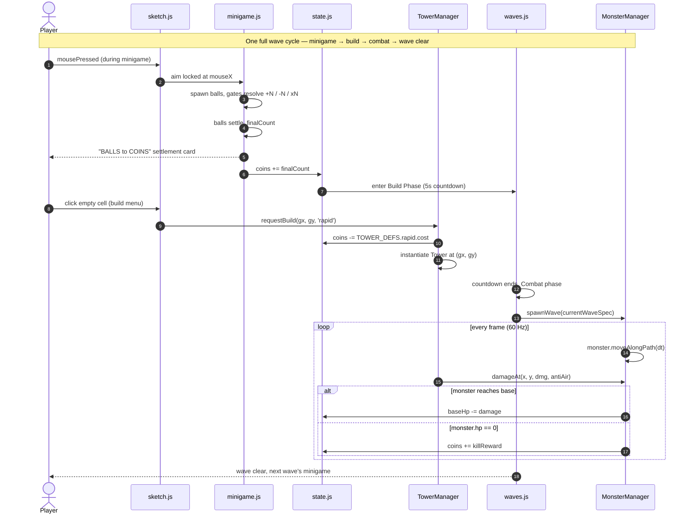

> *Two messages are worth flagging. Step 5 — the `BALLS → COINS` settlement card — was added after Round-1 playtests showed 3 of 4 testers didn't realise the ball count *was* the coin payout (§5.2). The `loop every frame (60 Hz)` block is where the §4.3 sub-step integration loop lives: the inner `moveAlongPath(dt)` actually iterates over micro-steps, not a single delta, to stop fast enemies from tunnelling through corners.*

### 3.4 Class diagram (central cluster)

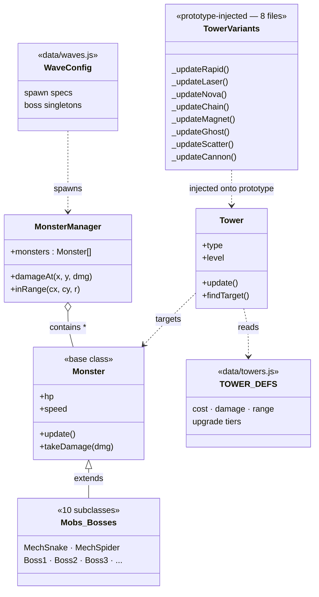

### 3.5 Key design decisions (full rationale in [`DESIGN.md`](DESIGN.md))

1. **Prototype extension instead of subclassing.** Every call site already used `new Tower(gx, gy, 'rapid')`; subclassing would have forced a factory-rewrite of every caller. Instead, each variant (`towers/variants/rapid.js` …) attaches to `Tower.prototype`, so the eight files split behaviour without touching callers. Trade-off: no `instanceof RapidTower` checks — but `tower.type === 'rapid'` is already the dispatch key.

2. **Centralise state declarations, not access.** We considered full namespacing (`Game.state.coins`) but chose to only move the *declarations* into `state.js`. Every `coins += reward` elsewhere keeps working unchanged. Goal was *traceability* (one file lists every global), not encapsulation.

3. **Data tables separate from logic.** `data/towers.js`, `data/waves.js`, `data/levels.js` are pure configuration. Balancing is a one-file edit; unit tests can load configs without pulling in the renderer.

4. **Caches keyed on `(state, language)`.** HUD text, tower tooltips, wave-preview boxes all cache rendered strings. Each cache signature includes `currentLang`, so toggling EN/中 at runtime invalidates them correctly.

5. **Programmatic visuals.** No sprite sheets. Every entity is drawn from primitives + trigonometry so the aesthetic stays coherent across six contributors.

### 3.6 User-experience design

We treated three UX surfaces as design problems with explicit alternatives, not implementation tasks.

**First-run tutorial (Level 1 only).** A five-step overlay with highlight boxes runs the first time a player enters Level 1; completion is persisted in `localStorage['qd_tutorial_l1_done']`, and the player can skip. We kept it Level-1 only because returning players don't need it, and we kept it *informational* rather than scripted — a forced "click this tower now" sequence breaks immersion and is harder to maintain when tower stats change. The trade-off is that a stubborn novice can still skip past the loop explanation; round-2 playtests showed 4/4 understood the loop by wave 2 anyway.

**Internationalisation (EN / 中文).** The UI is bilingual with a runtime toggle on the launch screen, persisted in `localStorage['qd_lang']`. We chose runtime `t(key)` lookup over a build-time string-replace pre-processor because (a) p5.js has no build step — a pre-processor would have broken the zero-tooling promise; (b) players can switch language on the fly without a reload; (c) translations live in one file (`i18n.js`) so any team member can contribute in parallel. Stylised codes (`RAPID`, `LASER`, `SECTOR ALPHA`) stay in English by design — matching how other sci-fi games treat codes vs prose.

**Level-map description cards.** In v1.4 the level description sat in a fixed sidebar panel; in v2.0 we anchored it next to each level node with a connecting line. This removes the *"which level is this describing?"* ambiguity when a player hovers between adjacent nodes — a refactor-time UX improvement that fell out of the v2.0 sprint rather than the heuristic eval.

### 3.7 Audio architecture

`audio.js` wraps native `HTMLAudioElement` rather than `p5.sound` — the sound library was an unnecessary dependency given six BGM tracks and five SFX with no spatial mixing or DSP needs. The mute toggle persists in `localStorage['qd_muted']`; the launch BGM doubles as a *user-gesture gate* (browsers block auto-play until the player clicks the language button or DEV ALL LEVELS), which happens to satisfy autoplay-policy compliance for free.

### 3.8 Per-level pacing

Each level introduces one new mechanic and tightens one constraint, so players meet new ideas in isolation before having to combine them:

| Level | Introduces | Tightens |
|---|---|---|
| 1 Sector Alpha | Core loop (mini-game → build → defend) | — (training wheels: ¥2000, 6 waves) |
| 2 Nebula Rift | Dual lanes + first aerial enemies | Starting credits drop to ¥1800 |
| 3 Iron Citadel | Armoured Tank + first Boss (Fission Core) | Path branches; AA towers become essential |
| 4 Void Maze | Speed enemies (Mech Spider with 3.5× dash bursts) | Tight corner geometry — the path that motivated *Implementation › Challenge 3* |
| 5 Omega Gate | All three bosses can co-exist in late waves | ¥1200 start; 10 waves; failure resets the level |

`data/waves.js` follows this shape: each level's first wave teaches its new mechanic in isolation; final waves combine that mechanic with everything previously introduced. Balance values live alongside in `data/levels.js` and are covered by the `node:test` shape invariants (e.g. *startCoins is strictly decreasing across levels*).

<br>


<br>

<a name="4-implementation"></a>
<h2 align="center">4. Implementation</h2>

We focus this section on the **three biggest technical challenges**: the minigame physics + gate lattice, the v1.4 → v2.0 refactor of three god-files into concern-oriented modules, and the multi-lane pathfinding integration that prevents fast enemies from tunnelling through path bends. Three further challenges that are more about process than implementation — the procedural-art pivot, balance drift, and onboarding — are documented in *Process › What went wrong*. A fourth, the canvas-based pseudo-3D mission-select rendering, is written up in [`workshop/week08/TECHNICAL_CHALLENGES.md`](workshop/week08/TECHNICAL_CHALLENGES.md) for the curious.

### 4.1 Challenge 1 — Ball-drop minigame (`minigame.js`, 847 lines)

<p align="center">
  
  <br>
  <sub><i>Aim → drop → settle. Each ball runs the four-state machine described below; gate hits feed a `spawnQueue` that's drained at the end of the frame so the iteration order is never mutated mid-flight.</i></sub>
</p>

The minigame has to feel physical and fair while producing a designer-tunable coin payout. It is a small state machine (`idle → aiming → playing → result`) with four coupled subsystems:

- **Aim phase.** Launcher follows `mouseX`; a click locks `aimX` and transitions to `playing`, but only if the click lands inside a deliberate target band — that prevents a fast mouse from teleporting mid-confirmation.
- **Ball physics.** Each ball is `{x, y, vx, vy}` with gravity `0.13`, wall bounce `0.42`, friction `0.984`, integrated Euler-style. Up to ~80 balls on screen — we use object pooling (`alive=false` + per-frame filter) instead of splicing, since splicing inside a 60 Hz loop compounds quadratically.
- **Gates.** Each gate is `{x, y, w, h, type: 'add' | 'sub' | 'mul', value}`. Generated column-by-column with constraints ("no two `×N` per column", "at least one positive-EV gate per row") so pathological boards are impossible. When a ball crosses a gate AABB with `triggered=false`: `add`/`sub` push `N` synthetic balls into a `spawnQueue` (never mutating `mgBalls` mid-iteration); `mul` replaces the ball with N copies on a micro-arc so they separate instead of overlapping.
- **Settlement.** Balls reaching `y = floor − BALL_R` get `settled = true`. When all are settled, the count converts to coins one-to-one — the player *sees* their score equal the coin payout, removing the "where did my coins go?" question that bit our first prototype.

The hard part was **balancing** without killing variance. We tune `shootTotal`, gate density, and gate-value distribution per level in `data/levels.js` so payouts land within ~±25 % of the design target — wide enough to reward a great aim, narrow enough that the tower economy stays tuned.

### 4.2 Challenge 2 — The v1.4 → v2.0 refactor

By the end of v1.4, three files had grown into god-classes:

| File          | Lines | What was mixed in |
|---------------|------:|-------------------|
| `monsters.js` | 2082  | 10 entity classes + manager + particle system + Boss AI |
| `towers.js`   | 1281  | 8 tower types dispatched by `if/else` inside one class |
| `ui.js`       |  934  | HUD + pause + build menu + tower panel + placement |

Merge conflicts on these three files had started to block parallel work for an entire week. The refactor had to hit three constraints simultaneously: (a) no gameplay behaviour change, (b) no call-site rewrites (too risky), (c) finish in one sprint.

**Approach.** We kept an instance of v1.4 open beside the new tree and worked top-down:

- **Extract pure data first.** `TOWER_DEFS`, `WAVE_CONFIGS`, `LEVEL_INFO` moved into `data/`. That alone removed ~400 mixed lines from the logic files.
- **Centralise state.** Every `let coins = …`, `let gamePhase = …` was moved into `state.js` declaration-only. Every `coins += reward` elsewhere stayed intact.
- **Split by concern, not by alphabet.** `monsters/` became `core.js + mobs/{snake,spider,…}.js + bosses/{fission,phantom,antmech,…}.js + manager.js`. `ui/` became `hud + pause + wave-ui + build-menu + tower-panel + placement`.
- **Towers by prototype extension.** We tried subclassing first but abandoned it after 20 minutes — every call site would have needed a factory. Switching to `Tower.prototype._updateRapid = function(){…}` meant each of the eight variants became one short file, injected on load, with zero caller changes.

Verification was manual: before-and-after playthroughs of all five levels at both difficulties. v2.0 shipped with identical gameplay — the only two observed deltas were latent v1.4 bugs (a tower-targeting edge case and a boss-HP lookup mismatch) that the cleaner module boundaries surfaced and we fixed in flight. The payoff was visible by week 9: three of us landed sound, the perf HUD, and responsive CSS *in parallel* with zero merge conflicts.

### 4.3 Challenge 3 — Multi-lane pathfinding without waypoint tunnelling

Quantum Drop runs up to three simultaneous enemy paths (main / edge / air), with up to ten monsters of different types active at once and Magnet-tower slow effects modifying their speed mid-run. Each monster stores its position as a continuous **progress value** (0.0 → 1.0) along a pre-computed array of pixel waypoints; every frame, the engine must:

1. Advance progress by `speed × dt × slowFactor`.
2. Interpolate the pixel position from the waypoint array.
3. Trigger a turn animation when a waypoint is crossed.
4. Trigger base damage on reaching the endpoint.
5. Handle the edge case where one frame's movement overshoots multiple waypoints.

The naïve fixed-delta update broke step 5: fast enemies (MechPhoenix, Boss Ant-Mech at 2-3× normal speed) "tunnelled" through sharp corners — visually jumping past Level 4's bends instead of following them. The artefact was distracting and (worse) broke line-of-sight calculations for towers anchored near the corner.

The fix is a **sub-step integration loop** in `monster.moveAlongPath()`. Each frame's movement is subdivided into micro-steps no longer than the next waypoint segment, so the geometry is followed exactly regardless of speed:

```javascript
moveAlongPath(dt) {
  let remaining = this.speed * dt * slowFactor;
  while (remaining > 0) {
    const segLen = distToNextWaypoint(this.progress, this.pathArray);
    const step   = min(remaining, segLen);
    this.progress += step / totalPathLength;
    remaining     -= step;
    if (reachedWaypoint()) triggerTurnAnimation();
    if (reachedEnd())      { triggerBaseDamage(); break; }
  }
}
```

The trade-off is per-frame cost proportional to monster speed, but the perf HUD confirmed it was within budget: 20+ simultaneous high-speed enemies on Level 4 stayed at 60 fps. Tunnelling artefacts disappeared, and the fix also closed a latent bug where the base occasionally took *less* damage than expected when a fast enemy overshot the endpoint within the same tick.

<br>


<br>

<a name="5-evaluation"></a>
<h2 align="center">5. Evaluation</h2>

Three layers, each in a different project phase: a week-7 **heuristic walkthrough** (expert review), weeks 8-9 **playtest rounds** (think-aloud + interview), and final **per-frame performance measurement** via the `F`-key perf HUD. Each fed the next — heuristic findings drove v2.0 UI fixes, playtest feedback drove the tutorial, perf measurement validated the refactor.

### 5.1 Heuristic evaluation (Week 7)

We ran a Nielsen heuristic walkthrough on the v1.3 build (lead: Zhang Xun). Each issue was scored on **Frequency / Impact / Persistence** (0-4 each) and rolled up to **severity = (F + I + P) / 3**. The walkthrough surfaced nine actionable issues; six are at severity ≥ 3.5, three of them at the maximum 4.0. Source: [`workshop/week07/Heuristic_Evaluation_Report.md`](workshop/week07/Heuristic_Evaluation_Report.md).

| Interface | Issue (paraphrased) | Heuristic(s) violated | Severity | v2.1 status |
|---|---|---|---:|---|
| Home Page UI | No onboarding / tutorial / instructions for new players | H10 *Help & docs*, H6 *Recognition*, H1 *Visibility* | **4.0** | ✅ Five-step Level-1 tutorial (`tutorial.js`) shipped |
| Base Health System | Enemies vanish on hit; HP deduction has no visual or numerical feedback | H1 *Visibility*, H5 *Error prevention* | **4.0** | ✅ HUD shows live `baseHp / baseHpMax` with damage flash |
| Flying Enemy Balance | Air units move too fast for reaction | H5 *Error prevention*, H7 *Flexibility* | **4.0** | ✅ Speeds re-tuned in `data/waves.js`; SCATTER tower added for AA |
| Tower System Design | No AoE tower limits strategic diversity | H7, H2 *Real-world match* | **3.67** | ✅ NOVA (piercing AoE) and CANNON (manual blast) added |
| Enemy Spawn System | Each path spawned only one fixed enemy type | H7, H2 | **3.67** | ✅ Wave-config now mixes types per spawn list |
| Air Path System | Air-route mechanics unclear; movement-speed logic differs without explanation | H2, H1 | **3.67** | 🟡 Tooltip prose + i18n labels added; mechanics still implicit |
| Anti-Air Tower Mechanism | AA balance felt off | H7, H4 *Consistency* | **3.33** | ✅ Split into SCATTER + GHOST with separate cost / role tiers |
| Upgrade System | Maximum upgrade level not clearly indicated | H1, H6 | **3.33** | ✅ Tower-upgrade panel shows current / max tier explicitly |
| Tower Selection Interface | First two towers were functionally redundant | H8 *Aesthetic & minimalist*, H4 | **3.0** | ✅ v2.0 dropped the redundant tower; eight distinct variants ship |

**Eight of nine issues closed** by v2.1; the remaining one (Air Path System) is partially mitigated by tooltips + i18n labels but the underlying mechanic is still better experienced than read about. Hour-for-hour, the most actionable feedback we got — it predates the playtest rounds below and shaped what those sessions could probe.

### 5.2 Qualitative — playtest observations

Two playtest rounds with four external testers each (eight unique participants, none on the course). Round 1 used v1.4 before the tutorial landed; round 2 used v2.1 with the tutorial, sound, and responsive canvas. Each tester played Level 1 unprompted, observed silently, then a short semi-structured interview (five questions, 3–5 minutes).

**Round 1 pain points.** 3/4 didn't realise the ball count *was* the coin payout (thought coins came from monster kills). 2/4 clicked the battlefield before build phase and got silent rejection. 4/4 didn't recognise the `CHAIN` and `MAGNET` icons.

**Changes shipped in response.** Settlement screen now prints `BALLS → COINS` with matching colour; silent rejection became a "Wait for Build Phase" hint; tower tooltips gained one-line plain-English descriptions, localised.

**Round 2 results.** 4/4 understood the economy loop by wave 2; 0/4 triggered silent-rejection; 3/4 found the tutorial helpful, 1/4 skipped it and still finished — the intended outcome.

The takeaway: *the mechanical systems were right in v1.4; what was wrong was that the player couldn't read the causal chain between them.* Most late-stage work was information design rather than new features.

### 5.3 Quantitative — performance measurement

After the perf HUD landed (`ui/perf-hud.js`, toggle with `F`), we measured frame rate under three scripted stress scenarios on a 2020 M1 MacBook Air (Chrome 131, no throttling):

| Scenario                                 | Monsters on screen | Towers placed | Projectiles | FPS (avg) | Frame time p95 |
|------------------------------------------|-------------------:|--------------:|------------:|----------:|---------------:|
| Level 1 wave 3 (baseline)                |                 12 |             5 |          ~8 |        60 |        16.9 ms |
| Level 3 wave 6 (mid-complexity)          |                 28 |            11 |         ~25 |        60 |        17.4 ms |
| Level 5 final wave (worst case)          |                 45 |            16 |         ~60 |      58.7 |        22.1 ms |
| Level 5 final wave + Boss3 Berserk       |                 45 |            16 |         ~85 |      54.2 |        28.6 ms |

<p align="center">
  
  <br>
  <sub><i>Level 5 final wave + Boss 3 Berserk — the worst-case row in the table above. The clip is the actual on-screen scene used for the perf measurement: 45 monsters, 16 towers, ~85 projectiles, sustained 54.2 FPS with p95 frame time 28.6 ms.</i></sub>
</p>

We stay at vsync for ordinary play and drop to ~54 FPS only during the final boss's Berserk phase — a three-second window. Three optimisations carried the load: **object pooling** (no splicing in the hot loop), an **HUD text cache** keyed on `(coins, hp, wave, frame/30, currentLang)` — the hottest path before caching — and a build-once **`pathCellSet`** in `map-core.js` that turned per-frame path containment from a nested loop into O(1) lookup. v1.4 and v2.1 produced statistically indistinguishable FPS, confirming the refactor didn't regress performance.

### 5.4 Code testing

Because the game uses no build step, most of the source depends on p5 or browser globals. We nonetheless built a **`node:test` suite of 48 unit tests** covering the testable pure layers:

| File                              | Scope                                                                 |
|-----------------------------------|-----------------------------------------------------------------------|
| `tests/i18n.test.js`              | key parity EN/中, `{0}/{1}` substitution, zh→en→key fallback chain    |
| `tests/data-towers.test.js`       | 8 towers × 3 tiers schema, monotonic dmg/range, anti-air flags        |
| `tests/data-waves.test.js`        | per-level wave counts, spawn-spec shape, boss singleton sentinels     |
| `tests/data-levels.test.js`       | `LEVEL_INFO` ↔ `LEVEL_NODES` consistency, startCoins monotonicity     |
| `tests/map-core.test.js`          | `pathToPixels`, `isCellBuildable` (bounds/HUD/path/occupancy/levels)  |

Tests run in ~80 ms via `npm test` (Node ≥ 18, **no `npm install` needed**). The harness is a `vm.createContext` sandbox that stubs p5 math helpers and `localStorage`, runs the target source files in script-tag order, and promotes top-level bindings onto `globalThis` — so the browser game and the test runner read the *same unchanged files*. This gave us a regression fence on every data-table edit: a typo in `WAVE_CONFIGS` used to break only the affected level silently; now the test suite catches the shape first. (Implementation walkthrough in [Appendix A · Run the unit tests](#a2-run-the-unit-tests).) Manual testing remained the backbone for animation, audio, and visual regression — none worth snapshot-testing for a ten-week project.

<br>


<br>

<a name="6-process"></a>
<h2 align="center">6. Process</h2>

### 6.1 Tools & cadence

- **GitHub** for hosting, with GitHub Pages auto-deploying the `docs/` folder so every merged PR produced a playable build at a URL anyone could share.
- **Weekly workshop (Wednesdays)** for synchronous planning, demo and blocker discussion.
- **Async chat** (WeChat) for day-to-day coordination across time-zone overlaps.
- **draw.io** for early class and sequence diagrams (`workshop/week05/*.xml`); the up-to-date diagrams in this report are Mermaid blocks living next to the prose.
- **VS Code + Live Server** as the shared development environment — chosen because it has zero setup for a fresh contributor.
- **p5.js web editor** for one-off experiments (the Plinko paper prototype was first a p5 sketch in the online editor).

### 6.2 Workflow

We used trunk-based development with short-lived feature branches (`feature/tower-cannon`, `feature/i18n`, `fix/wave5-boss-spawn`, …). PRs needed one reviewer; anything touching `state.js`, `data/*` or `sketch.js` needed the module owner specifically. Merges to `main` triggered the GitHub Pages redeploy, so we treated a broken build on `main` as an *"everyone stops, someone reverts"* incident. That happened twice during the term — both were script-load-order regressions after a file split — and the revert-first rule kept main shareable within minutes both times.

### 6.3 Workshop cadence

The Wednesday workshop ran ~90 minutes in four blocks:

1. **5 min — round-the-table demo.** Each member showed one merged change from the past week, even if small. This kept everyone aware of what other modules looked like and surfaced visual inconsistencies early.
2. **30 min — work session.** Pair- or triple-programming on the biggest current blocker, usually a cross-module integration.
3. **45 min — sprint planning** for the next week, picking from the MoSCoW list. Anything that crossed module boundaries got assigned a primary owner *and* a reviewer in the same session.
4. **10 min — short retro:** *"one thing going well, one thing blocked."* That ten-minute habit caught both the art-pipeline failure (week 4) and the god-file merge-conflict problem (week 7) early enough to act on them.

The cadence was deliberately under-engineered: no Jira, no story points, no formal stand-ups. With six people and a ten-week timeline, a written sprint plan in `workshop/weekN/sprint.md` plus a Pages-preview demo loop did more for momentum than any heavier process would have.

### 6.4 What went wrong (and what we changed)

- **Art pipeline stalled early.** Our initial plan relied on hand-drawn sprites; two weeks in, the sprites didn't match across contributors and hadn't been finalised. We pivoted to fully procedural visuals (polar coordinates, particle systems, glow passes) — ugly for a week, then rapidly unified because everyone shared the same drawing primitives. This cost us ~1.5 weeks but removed an asset-versioning problem that would have dogged us to the end.

- **Three files became god-classes.** `monsters.js` (2082 L), `towers.js` (1281 L), `ui.js` (934 L) started attracting every new feature because "that's where tower-related code lives". Parallel PRs started colliding weekly. We did the v1.4 → v2.0 refactor in a dedicated sprint (detailed in *Implementation*), after which conflicts effectively stopped.

- **Balance drift.** Adding a new tower or enemy could silently break the tuning of a distant level. We responded by extracting all balance values into `data/` and later adding unit tests that assert *shape* invariants (every boss singleton uses the `interval=9999` sentinel; `startCoins` are strictly decreasing across levels). These are cheap tests that would catch 80 % of accidental balance regressions.

- **Underestimating onboarding.** Round-1 playtesters didn't understand the economy loop. We added a five-step Level-1 tutorial, tooltip prose, and the `BALLS → COINS` settlement card. The fix was narrative, not mechanical.

### 6.5 What worked

- **One owner per module.** Zero "who was supposed to do this?" moments.
- **Zero-build tech stack.** New contributors were productive within an hour.
- **Script load order as the dependency graph.** A single file (`index.html`) makes the dependency DAG grep-able.
- **Live Pages preview per merge.** We could share a URL with a playtester within minutes of a merge.
- **Honest retros.** We kept a short retro every workshop ("one thing going well, one thing blocked"). That's how we caught the art-pipeline problem early enough to pivot.

<br>


<br>

<a name="7-sustainability-ethics--accessibility"></a>
<h2 align="center">7. Sustainability, Ethics &amp; Accessibility</h2>

We applied the **Sustainability Awareness Framework (SusAF)** to Quantum Drop after the v2.0 refactor: by then the architecture was stable enough that we could ask "what trade-offs are we *actually* shipping?" rather than projecting onto a moving target. The dimensions below cover the build as it stands in v2.1 — what holds up, where we cut corners, and what a v2.2 would prioritise.

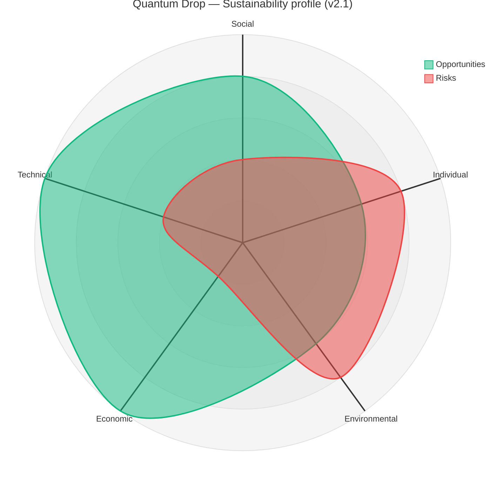

> *SusAD-style summary: green lobe = positive opportunities, red lobe = negative risks, both scored 0–5 from the prose below. Strongest in Economic (£0 stack) and Technical (refactor + tests); biggest gaps in Individual (no a11y panel yet) and Environmental (29 MB BGM payload). [Static fallback render](docs/screenshots/sus-radar.png) · [source](docs/screenshots/sus-radar.mmd)*

Quantum Drop is a single-player **zero-build static site** with no backend, no accounts, no telemetry, and no per-user data leaving the browser. State lives in four `localStorage` keys (`qd_lang`, `qd_muted`, `qd_perf`, `qd_tutorial_l1_done`) plus the highest unlocked level. The dimensions below cover **Environmental** (rubric requirement) plus **Individual** and **Technical** — chosen because they map to gameplay accessibility and to the v1.4 → v2.0 refactor — with separate **Ethics** notes scored alongside.

### 7.1 Environmental

The dominant cost is asset weight, not compute:

| Asset class | Bytes |
|---|---:|
| **BGM** (`assert/audio/bgm/*.mp3`, 6 tracks) | **~25.5 MB** |
| **SFX** (`assert/audio/sfx/*`, 5 files) | ~2.6 MB |
| Background art (`assert/*.png`, 1 file) | ~700 KB |
| Source code (`*.js`) | ~150 KB |
| **Total** | **~29 MB initial load** |

Because every entity is drawn from primitives — no sprites — the visual layer is essentially free at rest and costs CPU only when on screen. Object pooling, a `MAX_PARTICLES = 400` cap, and an HUD-text cache keep the per-frame budget flat: a Level-5 final wave sustains ~58 FPS on a 2020 M1 Air. Menus skip per-frame redraw when nothing has changed.

*Gap:* the 25 MB BGM payload on first load is more than the rest of the build combined — levels 2–5 currently preload eagerly. Lazy-loading them alongside their map data would cut first-load to ~10 MB without changing UX, and tops the v2.2 list.

### 7.2 Individual (player wellbeing & accessibility)

- **Pause menu** (`ui/pause.js`) interrupts at any frame and restores phase + frame counter — important for distraction-prone settings.
- **Difficulty toggle** (Easy / Difficult) widens the accommodated skill range (Easy: 1.3× starting credits, 30 base HP; Difficult: 20 base HP).
- **First-run tutorial** is a five-step overlay — *informational, not forced* — and persists via `localStorage['qd_tutorial_l1_done']` so returning players never re-encounter it.
- **No engagement-maximisation patterns**: no streaks, daily-login rewards, FOMO timers, IAP, notifications, or ads.

*Gap:* no dedicated accessibility settings UI. Colour-blind palettes for tower range rings, a high-contrast theme, dyslexia-friendly fonts, and keyboard-only input are all on the v2.2 list — none ship in v2.1. This is the largest sustainability deficit the radar flags.

### 7.3 Technical

The v1.4 → v2.0 refactor *was* the technical-sustainability deliverable:

- **Single source of truth for state** (`state.js`).
- **Data tables separated from logic** (`data/towers.js` / `data/waves.js` / `data/levels.js`) — balance never touches combat code.
- **Concern-oriented modules** (`monsters/`, `towers/`, `ui/`, `screens/`) — six contributors work in parallel without collisions on common files.
- **48 `node:test` cases** as a regression fence on every data-table edit (`npm test`, no install).
- **Mermaid architecture diagrams in the README** — diff cleanly with the prose, never go out of sync.

*Gap:* tuning numbers are centralised but spread across three `data/` files; a unified balance dashboard would help maintainers. Visual regression remains manual.

### 7.4 Ethics

- **Zero analytics, zero telemetry, zero tracking.** We grepped for `gtag`, `ga(`, Sentry, Mixpanel, Amplitude, Matomo and found nothing. The browser network tab during a full playthrough shows only static asset fetches.
- **No PII collected.** No name, no email, no account. Highest-unlocked-level is the only progression record, stored locally.
- **Asset provenance.** Visual entities are 100 % code-generated; the launch-screen background is Midjourney-generated (disclosed in *AI Usage Statement*). The audio layer is the only third-party material; per-track attribution is on the to-do list.
- **Open licence.** [MIT](LICENSE).

*Gap:* no in-game text explaining what `localStorage` keys are written, no "Delete save data" button — both 30-minute fixes deferred to v2.2.

### 7.5 Future actions

By ROI: **lazy-load BGM** for levels 2–5 (~15 MB saved), **accessibility settings panel**, **in-game privacy text + delete-save button**, **mobile / touch layout**, **per-track audio attribution**.

Quantum Drop's strongest sustainability wins come from saying *no* to things we never built — no accounts, no servers, no analytics, no asset pipeline. The remaining work is mostly explicit accommodation (accessibility) and honest disclosure (privacy text), not undoing structural choices.

<br>


<br>

<a name="8-conclusion"></a>
<h2 align="center">8. Conclusion</h2>

Over ten weeks we built, refactored, and shipped **Quantum Drop**: five playable levels, eight tower variants, ten enemy types (three bosses), a full ball-drop economy minigame, a first-run tutorial, bilingual UI (English + 中文), sound, a responsive canvas, a performance HUD, and a 48-case automated test suite. The game runs as a zero-build static site and is live on GitHub Pages.

### 8.1 Lessons learnt

**Prefer information design to new features.** By v1.4 the mechanical systems were sound; players just couldn't read the causal chain between the minigame and the economy. Two weeks of tutorial, tooltip, and settlement-visual work moved player comprehension more than any new feature could have in the same time. Playtesting with strangers was an order of magnitude more useful than playtesting within the team.

**Pay down technical debt before it compounds.** The v1.4 god-files were a known problem for two weeks before we acted — we kept patching around them because the refactor felt expensive. By the time it became unavoidable, parallel work was already serialised on merge conflicts. Next time we would schedule a "refactor sprint" the moment a single file crosses ~800 lines or blocks two concurrent PRs.

**Constraints often liberate.** The zero-build, no-sprite-sheet, shared-global-scope stack looked limiting in week 2 and turned out to be a quiet superpower. No build meant zero toolchain-debugging time; no sprites meant our aesthetic couldn't fracture across six contributors; shared globals meant `index.html`'s load-order became a trivially legible dependency graph.

### 8.2 Challenges

Three challenges stand out in retrospect — one per project axis: **scope** (everyone wanted their favourite mechanic; MoSCoW + a "nothing new after week 8" rule held), **code** (god-file merge conflicts, which the v1.4 → v2.0 refactor made stop overnight), and **comprehension** (mechanically correct ≠ readable to a first-time player — fixed narratively, not mechanically). Performance, by contrast, was easy: object pooling, text caching, and the path-cell set kept us at vsync.

### 8.3 Future work — immediate next steps for the current game

1. **Per-level star rating and best-time persistence** (localStorage key reserved; UI not yet built).
2. **Scripted tutorial interactions** — have the onboarding actually force a first build instead of describing one.
3. **Accessibility audit** — colour-blind palettes for the tower range rings; keyboard-only play; increased font sizes as an option.
4. **Mobile touch support** — `mouseX/mouseY` already works for taps; the bottleneck is the build menu sizing on narrow screens.
5. **Automated visual regression** — currently a manual check per level; a simple canvas-hash test per fixed frame would catch most rendering regressions cheaply.

### 8.4 Future work — if we had a sequel

Three directions: **persistent meta-progression** (a roguelite unlock layer over level-select, so a defeat still contributes to a long-horizon goal); **authored minigame boards** paired to a wave's threat profile (curated rather than procedural gates, for tighter mechanical storytelling); and **co-op** (two players sharing an economy but owning separate halves of the map). The engineering risk is bounded — the design risk (how do two players trade off economy vs defence?) is the harder research question.

Quantum Drop proved that a six-person team, a ten-week timeline, and p5.js can produce a game that is both technically coherent and fun to demo. Every member touched every stage of the stack — from data tables, through physics, through visual polish, through testing — which was the real point of the module.

<br>


<br>

<a name="9-contribution-statement"></a>
<h2 align="center">9. Contribution Statement</h2>

<div align="center">

| Contributor | Contribution |
|---|---|
| **Yu Chengyin** | Implemented the ball-drop mini-game physics in `minigame.js` — gravity / wall-bounce / friction integration, ball-gate AABB collision, and the `spawnQueue` mechanism that prevents in-loop array mutation. Integrated the audio layer (`audio.js`, six BGM tracks, five SFX) and wired the launch / difficulty / end-panel screens, including the mute toggle persisted in `localStorage['qd_muted']`. |
| **Zhu Qihao** | Designed the gate lattice for the mini-game (column-by-column generation with the "no two `×N` in the same column" constraint) and tuned the per-level economy in `data/levels.js` so payouts land within ±25 % of the design target. Co-owns balance with Zhang Xun via the data tables. |
| **Zhang Zhenyu** | Built the tower combat layer in `towers/` — eight tower variants (Rapid / Laser / Nova / Chain / Magnet / Ghost / Scatter / Cannon) plus the projectile and effects systems and special skills (CANNON manual aim, MAGNET slow). Owns performance profiling: designed the F-key perf HUD (`ui/perf-hud.js`) and led the CANNON-volley FPS regression diagnosis (particle cap + colour pre-resolve + emit-count tuning). |
| **Zhang Xun** | Implemented the monster system (`monsters/`) — ten entity classes including the three multi-phase bosses (Fission Core, Phantom Protocol, Ant-Mech) — and the wave state machine. Authored the heuristic evaluation report (`workshop/week07/Heuristic_Evaluation_Report.md`, nine Nielsen-heuristic issues with severity scoring) that drove a wave of UI fixes in v1.4. Tuned wave compositions across all five levels. |
| **Liu Bowen** | Owns the map / placement layer (`map/`, `ui/placement.js`) — per-level path geometry, cell-buildability rules, and the `pathCellSet` build-once cache. Wrote the four cache layers that kept Level-5 at vsync (HUD-text, tower-tooltip, wave-preview, path-cell). Co-led the v2.0 file-tree migration with Li Zhuolun; specifically split `monsters.js` into `monsters/` and verified gameplay parity across all five levels at both difficulties. |
| **Li Zhuolun** | Coordinated the v1.4 → v2.0 refactor sprint and acted as integration lead. Personally migrated the UI layer (split `ui.js` into `hud / pause / wave-ui / build-menu / tower-panel / placement / index`), centralised mutable state into `state.js`, authored the first-run tutorial (`tutorial.js`), scaffolded the i18n table (`i18n.js`, EN / 中文), and built the `node:test` harness with the `vm.createContext` sandbox (48 tests, zero install). Authored this report and the presentation deck. |

</div>

This per-person breakdown supplements the [Group Members](#group-members) table at the top of the README — *Group Members* is the org chart (one owner per module); this *Contribution Statement* is each member's personal commit-trail across the term.

<br>


<br>

<a name="10-ai-usage-statement"></a>
<h2 align="center">10. AI Usage Statement</h2>

We disclose AI tool usage in line with University of Bristol guidance. **Game runtime code was written by team members; no AI code generation was used inside `docs/Game_v2.1/`.**

Specifically:

- **Game runtime code (`docs/Game_v2.1/*.js`)** — written by team members. No AI-generated source files. All design decisions (architecture, balance values, level layouts, the v1.4 → v2.0 refactor strategy) are team work.
- **Game entity visuals** — every monster, tower, projectile, particle and HUD element is drawn procedurally in JS from primitives + trigonometry. No AI-generated images are used for any in-game entity.
- **Launch-screen background image** (`docs/Game_v2.1/assert/mrrockyd0710_sci-fi_tower_defense_world_map_top-down_futuristic_<uuid>.png`) — generated with **Midjourney** as a static menu backdrop. It does not affect gameplay and is not used for any in-game entity.
- **Audio assets** (6 BGM tracks + 5 SFX in `assert/audio/`) — sourced from royalty-free libraries; per-track attribution is on the v2.2 to-do list (called out in *Sustainability › Future actions*).
- **Documentation** (this README, `REPORT.md`, `DESIGN.md`) — drafted by team members and refined with **Claude (Anthropic)** for English fluency, structure, and table layout. The Mermaid diagrams were drafted with AI help and verified against the actual source code (`gamePhase` / `minigameState` literal strings, `TOWER_DEFS` keys, etc.).
- **Presentation deck** (`video/Quantum_Drop_Group23.pptx`) and **speaker scripts** (`video/Quantum_Drop_Speaker_Scripts.pdf`) — AI-assisted: the team supplied the structure, content, and engineering details; Claude helped with slide layout choices and prose tightening for read-aloud pacing.
- **Playtests, evaluation findings, and the contribution statement above** — all human-authored. The two playtest rounds were run face-to-face by team members; no AI-generated participant data appears anywhere in this repo.

<br>


<br>

<a name="a-build--test-developers"></a>
<h2 align="center">Appendix A · Build &amp; Test (developers)</h2>

<a name="a1-run-the-game-locally"></a>

### A.1 Run the game locally

Requirements:
- [Visual Studio Code](https://code.visualstudio.com/)
- VS Code extension: **Live Server**

```text
1. File → Open Folder → select this repo
2. Right-click  docs/Game_v2.1/index.html
3. Choose       Open with Live Server
4. Browser opens at http://127.0.0.1:5500
```

> 💡 **Save reloads automatically.** `Ctrl+S` reloads the browser; no rebuild needed.
> 💡 **Quick-test all levels.** Click `DEV: ALL LEVELS` in the bottom-right of the launch screen.
> 💡 **Perf HUD.** Press `F` in-game for a live FPS / entity-count overlay.
> 💡 **Codex.** Open `codex.html` (right-click → *Open with Live Server*) for a grid preview of every monster + tower with switchable path shapes.

<a name="a2-run-the-unit-tests"></a>

### A.2 Run the unit tests

The **game** is zero-build, but we ship 48 `node:test` cases for the pure-data configs and pure-logic helpers — no `npm install` needed.

Requirements:
- Node.js ≥ 18 (ships with `node:test` and `node:assert`)

```bash
npm test
# or, equivalently
node --test tests/*.test.js
```

How it works in one paragraph: `tests/helpers/load.js` builds a `vm.createContext` sandbox that stubs p5 math helpers and `localStorage`, runs the requested source files into the sandbox in script-tag order, then promotes their top-level `const`/`let` bindings onto `globalThis`. Tests reach them via `ctx.TOWER_DEFS`, `ctx.t(…)`, `ctx.isCellBuildable(…)` — the browser game and the test runner read the **same unchanged files**.

<a name="a3-source-tree-reference"></a>

### A.3 Source-tree reference

```
2026-group-23/
├── docs/
│   ├── Game_v0.3/            # legacy
│   ├── Game_v1.3/            # legacy
│   ├── Game_v1.4/            # legacy (pre-refactor)
│   └── Game_v2.1/            # current shipping build
│       ├── index.html        # script load order — DO NOT REORDER
│       ├── sketch.js         # p5 entry: setup(), draw(), phase router
│       ├── state.js          # all mutable globals
│       ├── audio.js          # HTMLAudio wrapper + mute toggle
│       ├── data/             # pure config (TOWER_DEFS, WAVE_CONFIGS, LEVEL_INFO)
│       ├── map/              # paths + per-level backgrounds
│       ├── monsters/         # base + mobs/* + bosses/* + manager
│       ├── towers/           # base + variants/* (prototype-injected) + manager
│       ├── ui/               # hud + pause + build-menu + tower-panel + placement
│       ├── screens/          # launch + difficulty + level-map + end-panel
│       ├── minigame.js       # ball-drop economy
│       ├── waves.js          # wave state machine
│       └── tutorial.js       # first-run overlay
├── tests/                    # 48 node:test cases (zero-install)
├── video/                    # demo video, slides, speaker scripts
├── workshop/                 # weekly artefacts (week01 … week10)
├── DESIGN.md                 # design decisions (companion document)
├── REPORT.md                 # canonical report (mirror of this README's report section)
└── README.md                 # ← you are here
```

> **Important:** The script load order in `docs/Game_v2.1/index.html` must not be changed — later files depend on earlier ones.

<a name="a4-key-apis"></a>

### A.4 Key APIs

```js
// Coins
coins += n;   // Gain
coins -= n;   // Spend (always check coins >= cost first)

// Monster manager
manager.monsters                                      // Array of all active monsters
manager.getMonstersInRange(cx, cy, range, antiAir)    // Range query
manager.damageAt(x, y, dmg, antiAir, fromSide)        // Point damage
manager.damageInRadius(cx, cy, radius, dmg, antiAir)  // AoE damage

// Map / placement
isCellBuildable(gx, gy)   // false if cell is path / HUD / occupied
initMap()                  // Load path + background for currentLevel

// Phase transitions
gamePhase = 'playing';
initGame();                // initialise based on currentLevel + gameDifficulty

// Tower jam (e.g. Phoenix EMP)
jammedUntilFrame = frameCount + duration;  // disable all towers for `duration` frames
```

<a name="a5-globals-state-js"></a>

### A.5 Globals (`state.js`)

| Variable | Description | Default |
|---|---|---|
| `CELL_SIZE` | Pixels per grid cell | `70` |
| `GRID_COLS` / `GRID_ROWS` | Map dimensions | `14` / `12` |
| `HUD_HEIGHT` | Top HUD bar (px) | `46` |
| `coins` | Current coins | Set by level + difficulty |
| `baseHp` / `baseHpMax` | Current / max base HP | EASY 30, DIFFICULT 20 |
| `waveNum` / `TOTAL_WAVES` | Current / total waves | Per level (6–10) |
| `COUNTDOWN_FRAMES` | Frames between waves | `300` (5 s) |
| `currentLevel` / `unlockedLevel` | Active / highest unlocked level | `1` / `1` |
| `gameDifficulty` | `'easy'` / `'difficult'` | `'easy'` |
| `gamePhase` | `'launch'` / `'difficulty'` / `'levelmap'` / `'playing'` / `'endpanel'` | `'launch'` |
| `jammedUntilFrame` | Frame at which jam ends | `0` |
| `tutorialActive` / `tutorialStep` | First-run Level-1 tutorial state | `false` / `0` |

<br>


<br>

<a name="b-acknowledgements"></a>
<h2 align="center">Appendix B · Acknowledgements</h2>

<div align="center">

Built for **COMSM0166 — Software Engineering Discipline & Practice** at the University of Bristol, 2025-26. Thanks to the course staff for the brief and the eight playtesters who shaped the late-stage work.

[](LICENSE)

</div>

<br>


<div align="center">

<br>


&nbsp;

&nbsp;


<br><br>

</div>
