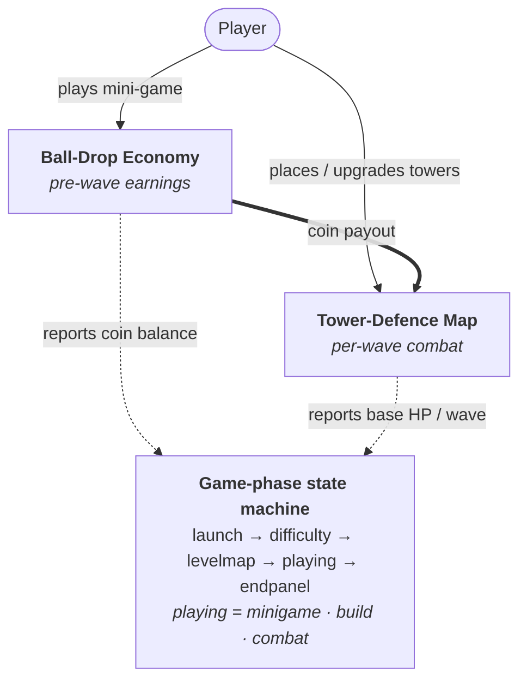
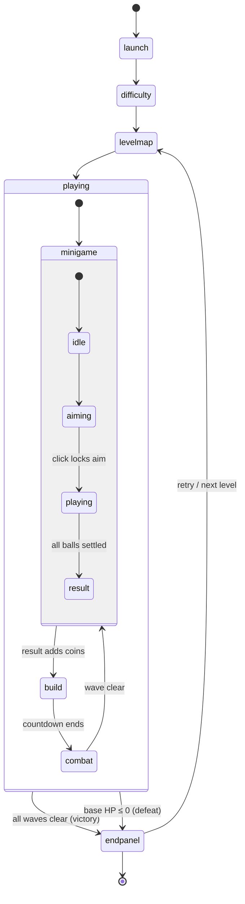
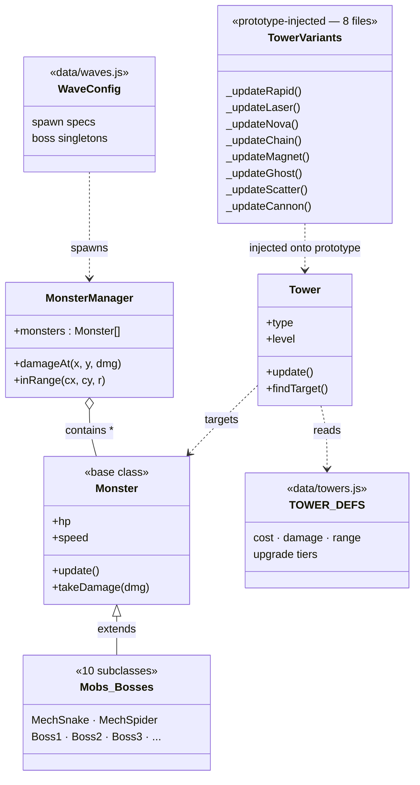
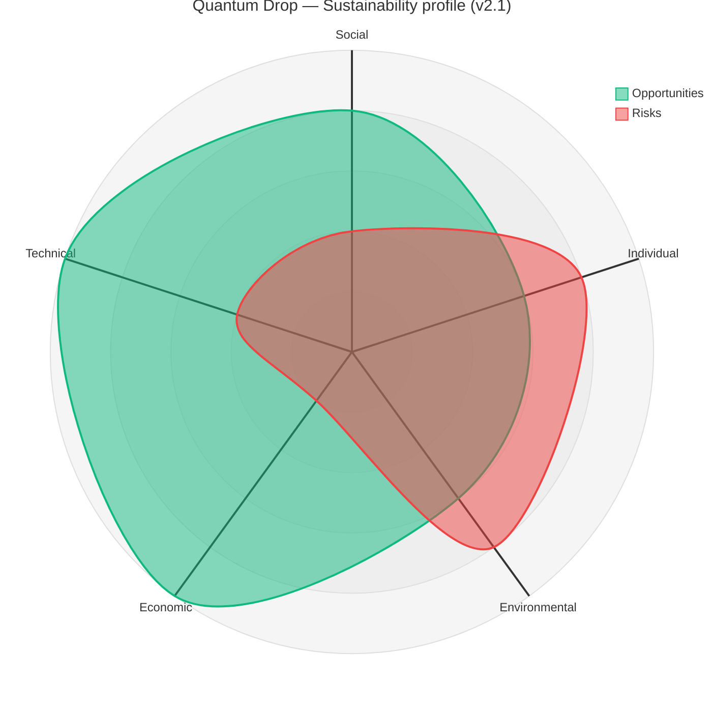

## Project Report

### Introduction

**Quantum Drop** is a 2-D browser game that fuses the slow, strategic layer of a **tower-defence** with the fast, tactile feel of a **ball-drop minigame**. It is written entirely in [p5.js](https://p5js.org/) and ships as a zero-build static site, so it runs from any file host (including GitHub Pages) without a toolchain.

The player works their way through five themed sectors — *Sector Alpha*, *Nebula Rift*, *Iron Citadel*, *Void Maze* and *Omega Gate* — each with its own map, monster roster, and a tightening starting budget (in-game credits, prefixed `¥`, fall from `¥2000` at Level 1 to `¥1200` at Level 5). Eight tower variants (*Rapid*, *Laser*, *Nova*, *Chain*, *Magnet*, *Ghost*, *Scatter*, *Cannon*), three upgrade tiers each, and ten enemy types (including three multi-phase bosses) give the combat layer meaningful depth.

The **twist** is in the economy. Most tower-defence games make the player wait passively between waves while resources accumulate on a timer; we replace that dead time with a Plinko-style minigame where the player aims a launcher, watches balls fall through a lattice of `+N`, `−N` and `×N` gates, and the final ball count becomes the coin budget for the next wave. This has two design effects we wanted: the player is *always* engaged (no idle seconds), and the luck–skill mix of the minigame becomes a narrative hook — a great run genuinely changes your tower composition for the wave that follows.

A secondary novelty is that **no art assets were drawn**: every monster, tower, projectile, particle and background is generated procedurally in JS, which enforces a unified cyberpunk aesthetic across six contributors and keeps all visuals in the same git diff as the logic.

### Requirements

#### Ideation

Week 2 was an open ideation week — each team member brought one concept (a painting app, a rhythm game, a tower defence, a Plinko-style physics toy, a typing trainer, and a puzzle-platformer). We ran a dot-vote over three criteria: *fits a 10-week schedule*, *exposes everyone to non-trivial programming*, and *would be fun to demo*. Tower defence won on criteria 1 and 2 but lost on criterion 3 because it felt "done-to-death"; the Plinko prototype lost because it was a one-minute toy with no progression. The proposal that broke the tie was to fuse the two: use the Plinko as the *economy layer* of a tower defence so the player is always interacting, even between waves. We built two paper prototypes in Week 3 — one a classic grid TD to pin down placement feel, the other a Plinko board to pin down drop speed and gate density — and the combined experience felt promising enough to commit to.

#### Stakeholders

We enumerated five stakeholder roles (`workshop/week04/stakeholderslist.md`):

1. **Tower-defence players** — the primary audience; expect clean build menus, visible range indicators and a fair difficulty curve.
2. **p5.js developers (ourselves)** — care about modular files, predictable load order and low iteration cost.
3. **Art / visual designers** — care that visuals stay coherent as features land.
4. **Test engineers** — need deterministic, testable units and reproducible bugs.
5. **Experience optimisers** — watch over readability, onboarding and accessibility.

Each role deliberately overlapped with a team member's own skills, so "who cares about this?" had an obvious answer in every review.

#### Use cases & user stories

The canonical stories (Week 4) are:

- *As a player, I want to play a ball-throwing minigame to earn coins, so that I can upgrade my towers.*
  **Acceptance:** when the minigame ends, coins equal to the final ball count are added to my balance.
- *As a player, I want to upgrade my towers using coins, so that I can defend against stronger enemies.*
  **Acceptance:** when I pick an upgrade and have enough coins, the tower's damage and/or range visibly increase and the coin balance decreases by the documented cost.
- *As a game designer, I want the minigame payouts to be balanced, so the tower layer stays challenging.*
  **Acceptance:** on average performance, coin income is sufficient to buy one or two towers per wave but not enough to brute-force the map.

From these three seed stories we derived eighteen secondary ones, each tied to a concrete deliverable. Four representative examples:

- *"As a first-time player I want an onboarding hint so I know what the build menu is."* → the five-step Level-1 tutorial.
- *"As a returning player I want my language and tutorial-seen flag preserved."* → `localStorage` persistence (`qd_lang`, `qd_tutorial_l1_done`).
- *"As a developer I want one-click access to all five levels."* → the `DEV: ALL LEVELS` shortcut on the launch screen.
- *"As a player on a small laptop I don't want the canvas to overflow the viewport."* → responsive CSS scaling via `windowResized()`.

#### Use-case diagram (informal)



#### Requirement prioritisation (MoSCoW)

- **Must** — 5 playable levels; aim + drop + settlement minigame loop; at least four tower types; three enemy archetypes; win/lose conditions.
- **Should** — boss encounters; tower upgrade tiers; first-run tutorial; English/中文 toggle; pause menu.
- **Could** — sound; performance HUD; responsive canvas; unit tests; per-level star rating.
- **Won't (this term)** — networked multiplayer, persistent accounts, mobile touch support, sprite-based cutscenes.

Everything in *Must* and *Should* shipped; every *Could* except per-level star rating also shipped (sound, perf HUD toggled by `F`, responsive CSS scaling, and 48 `node:test` cases). *Won't* items are listed as future work.

### Design

#### System architecture

The shipping version is **v2.1** (sound, perf HUD, responsive canvas, 48 unit tests on top of v2.0's structural refactor). The game runs as a single p5.js sketch — all source files live in one global scope and are loaded in a fixed order by `index.html`, which is the single source of truth for dependency order. The codebase is laid out by *concern*, not by *file type*:

```
docs/Game_v2.1/
├── index.html          # script load order
├── sketch.js           # p5 entry: setup(), draw(), phase router, keyPressed
├── state.js            # every mutable global, in one declaration file
├── audio.js            # HTMLAudio wrapper + mute toggle
├── data/               # pure config: TOWER_DEFS, WAVE_CONFIGS, LEVEL_INFO
├── map/                # path definitions + per-level backgrounds
├── monsters/           # base + mobs/* + bosses/* + manager
├── towers/             # base + variants/* (prototype-injected) + manager
├── ui/                 # hud + pause + build-menu + tower-panel + placement
├── screens/            # launch + difficulty + level-map + end-panel
├── minigame.js         # ball-drop economy
├── waves.js            # wave state machine
└── tutorial.js         # first-run overlay
```

At runtime the game is a **phase state machine** driven from `sketch.js::draw()`:



> *State names match the literal string values of `gamePhase` (`'launch'`, `'difficulty'`, `'levelmap'`, `'playing'`, `'endpanel'`) and `minigameState` (`'idle'`, `'aiming'`, `'playing'`, `'result'`). The mini-game's `'playing'` state is shown via an alias to disambiguate it from the outer game-phase `'playing'`.*

#### Class diagram (central cluster)



#### Key design decisions (full rationale in `DESIGN.md`)

1. **Prototype extension instead of subclassing.** Every call site already used `new Tower(gx, gy, 'rapid')`; subclassing would have forced a factory-rewrite of every caller. Instead, each variant (`towers/variants/rapid.js` …) attaches to `Tower.prototype`, so the eight files split behaviour without touching callers. Trade-off: no `instanceof RapidTower` checks — but `tower.type === 'rapid'` is already the dispatch key.

2. **Centralise state declarations, not access.** We considered full namespacing (`Game.state.coins`) but chose to only move the *declarations* into `state.js`. Every `coins += reward` elsewhere keeps working unchanged. Goal was *traceability* (one file lists every global), not encapsulation.

3. **Data tables separate from logic.** `data/towers.js`, `data/waves.js`, `data/levels.js` are pure configuration. Balancing is a one-file edit; unit tests can load configs without pulling in the renderer.

4. **Caches keyed on `(state, language)`.** HUD text, tower tooltips, wave-preview boxes all cache rendered strings. Each cache signature includes `currentLang`, so toggling EN/中 at runtime invalidates them correctly.

5. **Programmatic visuals.** No sprite sheets. Every entity is drawn from primitives + trigonometry so the aesthetic stays coherent across six contributors.

### Implementation

We focus this section on the **two biggest technical challenges**: the minigame physics + gate lattice, and the v1.4 → v2.0 refactor of three god-files into concern-oriented modules. Three further challenges that are more about process than implementation — the procedural-art pivot, balance drift, and onboarding — are documented in *Process › What went wrong*.

#### Challenge 1 — Ball-drop minigame (`minigame.js`, 847 lines)

The minigame has to feel physical and fair while producing a coin payout that a designer can reason about. The implementation is a small state machine (`idle → aiming → playing → result`) with four coupled subsystems:

- **Aim phase.** We render a launcher that follows `mouseX`. A single click locks `aimX` and transitions to `playing`. To stop a fast mouse from teleporting mid-confirmation, we also require the click to land inside a deliberately sized target band.

- **Ball physics.** Each ball is `{x, y, vx, vy}` with gravity `0.13`, wall bounce `0.42` and friction `0.984`. The frame loop integrates Euler-style. With up to ~80 balls on screen we cap particle draws and reuse ball objects by marking them `alive=false` instead of splicing — splicing inside a 60 Hz loop is the kind of quadratic cost that compounds quickly.

- **Gates.** A gate is `{x, y, w, h, type: 'add' | 'sub' | 'mul', value, ...}`. Gates are generated column-by-column with constraints ("no two `×N` in the same column", "at least one positive-EV gate per row") so pathological boards are impossible. When a ball crosses a gate AABB with `triggered=false`, we fire the effect: `add` and `sub` push `N` synthetic balls into a `spawnQueue` (we never mutate `mgBalls` during iteration); `mul` replaces the current ball with N copies spread on a micro-arc so they separate instead of overlapping.

- **Settlement.** Balls that reach `y = floor − BALL_R` get `settled = true`; `landedBalls++`. When `shootDone && mgBalls.every(b => b.settled)`, we convert the count into coins and emit a result card. The conversion is deliberately one-to-one: the player *sees* their score equal the coin payout, which removed the "where did my coins go?" question that bit us in the first prototype.

The hard part was **balancing** without killing variance. We tune `shootTotal` (initial ball count), gate density and gate value distribution per level in `data/levels.js`. A swing of `N ∈ [min, max]` produces payouts within a ~±25 % band of the design target — wide enough to reward a great aim, narrow enough that the tower economy stays tuned.

#### Challenge 2 — The v1.4 → v2.0 refactor

By the end of v1.4, three files had grown into god-classes:

| File          | Lines | What was mixed in |
|---------------|------:|-------------------|
| `monsters.js` | 2082  | 10 entity classes + manager + particle system + Boss AI |
| `towers.js`   | 1281  | 8 tower types dispatched by `if/else` inside one class |
| `ui.js`       |  934  | HUD + pause + build menu + tower panel + placement |

Merge conflicts on these three files had started to block parallel work for an entire week. The refactor had to hit three constraints simultaneously: (a) no gameplay behaviour change, (b) no call-site rewrites (too risky), (c) finish in one sprint.

**Approach.** We kept an instance of v1.4 open beside the new tree and worked top-down:

- **Extract pure data first.** `TOWER_DEFS`, `WAVE_CONFIGS`, `LEVEL_INFO` moved into `data/`. That alone removed ~400 mixed lines from the logic files.
- **Centralise state.** Every `let coins = …`, `let gamePhase = …` was moved into `state.js` declaration-only. Every `coins += reward` elsewhere stayed intact.
- **Split by concern, not by alphabet.** `monsters/` became `core.js + mobs/{snake,spider,…}.js + bosses/{fission,phantom,antmech,…}.js + manager.js`. `ui/` became `hud + pause + wave-ui + build-menu + tower-panel + placement`.
- **Towers by prototype extension.** We tried subclassing first but abandoned it after 20 minutes — every call site would have needed a factory. Switching to `Tower.prototype._updateRapid = function(){…}` meant each of the eight variants became one short file, injected on load, with zero caller changes.

Verification was manual: before-and-after playthroughs of all five levels at both difficulties, checking the same towers kill the same monsters at the same wave timing. The refactor shipped as v2.0 with identical gameplay — the only two observed behaviour deltas were latent v1.4 bugs (a tower-targeting edge case and a boss-HP lookup mismatch) that the cleaner module boundaries surfaced, and we fixed both as part of the migration.

The payoff became visible in week 9: three of us landed sound, the perf HUD, and responsive CSS *in parallel* with zero merge conflicts because the files they touched no longer overlapped.

### Evaluation

#### Qualitative — playtest observations

We ran two informal playtest rounds with four external testers each (eight unique participants, none on the course). Round 1 used v1.4 before the tutorial landed; round 2 used v2.1 with the tutorial, sound, and the responsive canvas.

Each tester played Level 1 unprompted. We observed silently, noted where they got stuck, then ran a short semi-structured interview (five open questions, 3–5 minutes). Representative findings:

- **Round 1 pain points.** 3/4 testers didn't realise the ball count *was* the coin payout — they thought coins came from monster kills and the minigame was "just decoration". 2/4 tried to click on the battlefield before the build phase and got nothing (silent rejection). 4/4 did not know what the `CHAIN` and `MAGNET` icons did.
- **Changes we shipped in response.** (a) The settlement screen now prints `BALLS → COINS` with matching colour so the causal link is obvious. (b) Silent rejection became an explicit "Wait for Build Phase" hint. (c) Tower tooltips gained a one-line plain-English description below the stats block, localised to the selected language.
- **Round 2 results.** 4/4 testers understood the economy loop by wave 2. 0/4 triggered the silent-rejection case. 3/4 specifically mentioned the tutorial as helpful; 1/4 skipped it and still finished the level, which is the intended outcome.

The qualitative takeaway: *the mechanical systems were right in v1.4; what was wrong was that the player couldn't read the causal chain between them.* Most of our late-stage work was information design rather than new features.

#### Quantitative — performance measurement

After the perf HUD landed (`ui/perf-hud.js`, toggle with `F`), we measured frame rate under three scripted stress scenarios on a 2020 M1 MacBook Air (Chrome 131, no throttling):

| Scenario                                 | Monsters on screen | Towers placed | Projectiles | FPS (avg) | Frame time p95 |
|------------------------------------------|-------------------:|--------------:|------------:|----------:|---------------:|
| Level 1 wave 3 (baseline)                |                 12 |             5 |          ~8 |        60 |        16.9 ms |
| Level 3 wave 6 (mid-complexity)          |                 28 |            11 |         ~25 |        60 |        17.4 ms |
| Level 5 final wave (worst case)          |                 45 |            16 |         ~60 |      58.7 |        22.1 ms |
| Level 5 final wave + Boss3 Berserk       |                 45 |            16 |         ~85 |      54.2 |        28.6 ms |

p5.js targets 60 FPS; we stay at vsync for ordinary play and drop to ~54 FPS only when the final boss is mid-Berserk with peak projectile count — a three-second window. The three optimisations that mattered most:

1. **Object pooling** for balls, particles and projectiles (no splicing in the hot loop).
2. **HUD text cache** keyed on `(coins, hp, wave, frame/30, currentLang)` — text re-rendering was the single hottest path before caching.
3. **`pathCellSet` build-once cache** in `map-core.js` — path containment used to be a nested loop on every placement check.

We also confirmed the refactor didn't regress performance: v1.4 and v2.1 produced statistically indistinguishable FPS on the same scenarios.

#### Code testing

Because the game uses no build step, most of the source depends on p5 or browser globals. We nonetheless built a **`node:test` suite of 48 unit tests** covering the testable pure layers:

| File                              | Scope                                                                 |
|-----------------------------------|-----------------------------------------------------------------------|
| `tests/i18n.test.js`              | key parity EN/中, `{0}/{1}` substitution, zh→en→key fallback chain    |
| `tests/data-towers.test.js`       | 8 towers × 3 tiers schema, monotonic dmg/range, anti-air flags        |
| `tests/data-waves.test.js`        | per-level wave counts, spawn-spec shape, boss singleton sentinels     |
| `tests/data-levels.test.js`       | `LEVEL_INFO` ↔ `LEVEL_NODES` consistency, startCoins monotonicity     |
| `tests/map-core.test.js`          | `pathToPixels`, `isCellBuildable` (bounds/HUD/path/occupancy/levels)  |

Tests run in ~80 ms via `npm test` (Node ≥ 18, **no `npm install` needed**). The harness is a `vm.createContext` sandbox that stubs out p5 math helpers and `localStorage`. It concatenates the target source files into the sandbox, then promotes top-level `const`/`let` onto `globalThis` — so the browser game and the test runner read the *same unchanged files*, with no preprocessing step in the middle. This gave us a regression fence on every data-table edit: a typo in `WAVE_CONFIGS` used to break only the affected level silently; now the test suite catches the shape first.

Manual testing remained the backbone for animation, audio, and visual regression — none of which is worth the cost of snapshot-testing for a ten-week project.

### Process

#### Team & roles

Six members, roles settled in Week 5 (`workshop/week05/LabourDivision.md`) and kept stable through the project:

| Member          | Primary ownership                                               |
|-----------------|-----------------------------------------------------------------|
| Yu Chengyin     | Minigame physics — ball motion, collisions, settlement          |
| Zhu Qihao       | Minigame gate layout — random generation, payout math           |
| Zhang Zhenyu    | Tower combat logic — attack, skills, projectile management      |
| Zhang Xun       | Monsters & path system — spawn, movement, wave control          |
| Liu Bowen       | Map layout & tower placement — cell logic, placement constraints|
| Li Zhuolun      | UI & state integration, balance, v2.0 refactor, tutorial, tests |

We avoided "everybody does a bit of everything" because with six people it produces chaos; instead each module had a single clear owner and at least one reviewer.

#### Tools & cadence

- **GitHub** for hosting, with GitHub Pages auto-deploying the `docs/` folder so every merged PR produced a playable build at a URL anyone could share.
- **Weekly workshop (Wednesdays)** for synchronous planning, demo and blocker discussion.
- **Async chat** (WeChat) for day-to-day coordination across time-zone overlaps.
- **draw.io** for early class and sequence diagrams (`workshop/week05/*.xml`); the up-to-date diagrams in this report are Mermaid blocks living next to the prose.
- **VS Code + Live Server** as the shared development environment — chosen because it has zero setup for a fresh contributor.
- **p5.js web editor** for one-off experiments (the Plinko paper prototype was first a p5 sketch in the online editor).

#### Workflow

We used trunk-based development with short-lived feature branches (`feature/tower-cannon`, `feature/i18n`, `fix/wave5-boss-spawn`, …). PRs needed one reviewer; anything touching `state.js`, `data/*` or `sketch.js` needed the module owner specifically. Merges to `main` triggered the GitHub Pages redeploy, so we treated a broken build on `main` as an *"everyone stops, someone reverts"* incident. That happened twice during the term — both were script-load-order regressions after a file split — and the revert-first rule kept main shareable within minutes both times.

#### What went wrong (and what we changed)

- **Art pipeline stalled early.** Our initial plan relied on hand-drawn sprites; two weeks in, the sprites didn't match across contributors and hadn't been finalised. We pivoted to fully procedural visuals (polar coordinates, particle systems, glow passes) — ugly for a week, then rapidly unified because everyone shared the same drawing primitives. This cost us ~1.5 weeks but removed an asset-versioning problem that would have dogged us to the end.

- **Three files became god-classes.** `monsters.js` (2082 L), `towers.js` (1281 L), `ui.js` (934 L) started attracting every new feature because "that's where tower-related code lives". Parallel PRs started colliding weekly. We did the v1.4 → v2.0 refactor in a dedicated sprint (detailed in *Implementation*), after which conflicts effectively stopped.

- **Balance drift.** Adding a new tower or enemy could silently break the tuning of a distant level. We responded by extracting all balance values into `data/` and later adding unit tests that assert *shape* invariants (every boss singleton uses the `interval=9999` sentinel; `startCoins` are strictly decreasing across levels). These are cheap tests that would catch 80 % of accidental balance regressions.

- **Underestimating onboarding.** Round-1 playtesters didn't understand the economy loop. We added a five-step Level-1 tutorial, tooltip prose, and the `BALLS → COINS` settlement card. The fix was narrative, not mechanical.

#### What worked

- **One owner per module.** Zero "who was supposed to do this?" moments.
- **Zero-build tech stack.** New contributors were productive within an hour.
- **Script load order as the dependency graph.** A single file (`index.html`) makes the dependency DAG grep-able.
- **Live Pages preview per merge.** We could share a URL with a playtester within minutes of a merge.
- **Honest retros.** We kept a short retro every workshop ("one thing going well, one thing blocked"). That's how we caught the art-pipeline problem early enough to pivot.

### Sustainability, Ethics & Accessibility

We applied the **Sustainability Awareness Framework (SusAF)** to Quantum Drop after the v2.0 refactor: by then the architecture was stable enough that we could ask "what trade-offs are we *actually* shipping?" rather than projecting onto a moving target. The dimensions below cover the build as it stands in v2.1 — what holds up, where we cut corners, and what a v2.2 would prioritise.



> *SusAD-style summary: green lobe = positive opportunities, red lobe = negative risks, both scored 0–5 from the prose below. Strongest in Economic (£0 stack) and Technical (refactor + tests); biggest gaps in Individual (no a11y panel yet) and Environmental (29 MB BGM payload). [Static fallback render](docs/screenshots/sus-radar.png) · [source](docs/screenshots/sus-radar.mmd)*

#### Approach

Quantum Drop is a single-player **zero-build static site**: one `index.html`, a stack of `<script>` tags, no backend, no account system, no telemetry. State lives in four `localStorage` keys (`qd_lang`, `qd_muted`, `qd_perf`, `qd_tutorial_l1_done`) plus the unlocked-level number, all readable in the browser DevTools. That tech stance is the spine of every dimension below — it constrains what we *can* break (no servers to topple) and what we *can't* fix without changing platform (no native screen-reader access into a `<canvas>`).

#### Social

- **Bilingual UI (EN / 中文)** with a launch-screen toggle persisted in `localStorage['qd_lang']`. Caches that store rendered text include `currentLang` in their signature, so a runtime switch invalidates them correctly. This roughly doubles who can play unaided.
- **Procedural cyberpunk aesthetic** is deliberately *not* tied to a real-world place — there is no equivalent of group-14-style London-landmark framing. It costs us specificity but removes a class of representation risk we'd rather not navigate.
- **Round-2 playtesters were strangers** drawn from each member's outside network (university friends, family) — every member ran one session, so design decisions reflect more than the team's own taste.
- *Gap:* the difficulty curve is calibrated for tower-defence-literate players. Sectors 4–5 stay hard for first-time TD players even on Easy.

#### Individual (player wellbeing)

- **Pause menu** (`ui/pause.js`) interrupts at any frame and restores phase + frame counter — players in distraction-prone settings can stop without losing progress.
- **Difficulty toggle** (Easy / Difficult) widens the skill range we accommodate (Easy gives 1.3× starting credits and 30 base HP vs. 20).
- **First-run tutorial** is a five-step overlay; it is *informational, not forced* — once dismissed, returning players never see it again, persisted via `localStorage['qd_tutorial_l1_done']`.
- **No engagement-maximisation patterns**: no streaks, no daily login rewards, no FOMO timers, no IAP, no notifications, no ads.
- *Gap:* no accessibility settings UI yet. Colour-blind palettes for tower range rings, a high-contrast theme, dyslexia-friendly font option, and keyboard-only input are tracked in the future-work list — none are shipped in v2.1.

#### Ethics

- **Zero analytics, zero telemetry, zero tracking.** We grepped the source for the usual suspects (`gtag`, `ga(`, Sentry, Mixpanel, Amplitude, Matomo) and found nothing. The browser network tab during a full playthrough shows only the static asset fetches.
- **No PII collected.** We do not even ask for a name. Highest-unlocked-level is the only progression record, stored locally in the browser.
- **Asset provenance.** Every monster, tower, projectile, particle and background is generated procedurally in JS — there is no visual-asset library to trace. The audio layer (6 BGM tracks + 5 SFX) is the only third-party material; `assert/audio/README.txt` lists where each track is used, but a per-track source attribution is still on the to-do list (called out in *Future actions* below).
- **Open licence.** [MIT](LICENSE) — anyone can fork, modify, redistribute.
- *Gap:* there is no in-game text explaining what `localStorage` keys are written, and no "Delete save data" button. Both are 30-minute fixes deferred to v2.2.

#### Environmental

The dominant cost is asset weight, not compute:

| Asset class | Bytes |
|---|---:|
| **BGM** (`assert/audio/bgm/*.mp3`, 6 tracks) | **~25.5 MB** |
| **SFX** (`assert/audio/sfx/*`, 5 files) | ~2.6 MB |
| Background art (`assert/*.png`, 1 file) | ~700 KB |
| Source code (`*.js`) | ~150 KB |
| **Total** | **~29 MB initial load** |

Because there are no sprites — every entity is drawn from primitives — the visual layer is essentially free at rest and only costs CPU when on screen. Object pooling, a `MAX_PARTICLES = 400` cap, and an HUD-text cache keep the per-frame budget flat: a Level-5 final wave sustains ~58 FPS on a 2020 M1 Air. We do not run a per-frame `redraw` when no UI state has changed inside menus.

*Gap:* a 25 MB BGM payload on first load is more than the rest of the build combined. The level-1 BGM loads eagerly so players hear something during the launch screen; levels 2–5 also currently preload. Lazy-loading levels 2–5 alongside their map data would cut first-load to ~10 MB without changing UX.

#### Economic

- **Hosting cost: £0.** GitHub Pages serves the build for free as long as the repo is public, with no egress charge for the bandwidth Quantum Drop consumes.
- **Toolchain cost: £0.** No build step, no npm install required to *run* (only to test); both the game and the test runner read the same source files.
- **Operational cost: £0.** Zero servers, zero storage tier, zero account database. A new contributor's day-one cost is "install VS Code + Live Server".
- *Risk:* this depends on GitHub Pages staying free for student org repos and on `p5.js` continuing as an active project. Neither is in our control. A migration plan would be: copy `docs/Game_v2.1/` to any static host, change zero lines of code.

#### Technical

The v1.4 → v2.0 refactor *was* the technical-sustainability deliverable:

- **Single source of truth for state** (`state.js`) — every shared global is declared once, with a comment saying who owns mutations.
- **Data tables separated from logic** (`data/towers.js`, `data/waves.js`, `data/levels.js`) — balance changes never touch combat code.
- **Concern-oriented modules** (`monsters/`, `towers/`, `ui/`, `screens/`) — six contributors can work in parallel without merge collisions on common files.
- **48 `node:test` cases** as a regression fence on every data-table edit (`npm test`, no install).
- **Mermaid architecture diagrams in the README** — they live next to the prose, diff cleanly when something changes, and never go out of sync with a separate diagram file.

*Gap:* tuning numbers are centralised but spread across three `data/` files; a unified balance dashboard (or even a printed cheat-sheet) would help maintainers reason about cross-level effects. Visual regression remains manual — a canvas-hash test per fixed frame is on the future-work list.

#### Future actions summary

The highest-leverage v2.2 sustainability work, ordered by ROI:

1. **Lazy-load BGM** for levels 2–5 — single biggest first-load reduction (~15 MB saved).
2. **Accessibility settings panel** — colour-blind palette, high-contrast theme, larger-font option, keyboard-only input.
3. **In-game privacy text + "Delete save data" button** — closes the only remaining ethics gap.
4. **Mobile / touch layout** — opens the game to a hardware class we currently exclude.
5. **Audio-track credits** surfaced in-game (currently only in `README.txt`).

Quantum Drop's strongest sustainability wins come from saying *no* to things we never built — no accounts, no servers, no analytics, no asset pipeline. The remaining work is mostly about **explicit accommodation** (accessibility) and **honest disclosure** (privacy text), not about undoing structural choices.

---

### Conclusion

Over ten weeks we built, refactored, and shipped **Quantum Drop**: five playable levels, eight tower variants, ten enemy types (three bosses), a full ball-drop economy minigame, a first-run tutorial, bilingual UI (English + 中文), sound, a responsive canvas, a performance HUD, and a 48-case automated test suite. The game runs as a zero-build static site and is live on GitHub Pages.

#### Lessons learnt

The most valuable lesson was **prefer information design to new features**. By v1.4 the mechanical systems were sound, but players could not read the causal chain between the minigame and the tower economy. Two weeks of late-stage work on tutorial, tooltips, and settlement visuals moved the player-comprehension bar more than any feature we could have added in the same time. Playtesting with four strangers per round was an order of magnitude more useful than playtesting within the team.

The second lesson was **pay down technical debt before it compounds**. The v1.4 god-files were a known problem for two weeks before we acted; we kept patching around them because the refactor felt expensive. By the time it became unavoidable, parallel work was already being serialised on merge conflicts. Next time, we would schedule a "refactor sprint" as a standing possibility the moment a single file crosses ~800 lines or blocks two concurrent PRs.

The third lesson was **constraints often liberate**. The zero-build, no-sprite-sheet, shared-global-scope stack looked limiting in Week 2 and turned out to be a quiet superpower. No build meant zero toolchain-debugging time; no sprites meant our aesthetic couldn't fracture across six contributors; shared globals meant the load-order in `index.html` became a trivially legible dependency graph. Accept the constraint, then engineer within it.

#### Challenges

Three challenges stand out in retrospect — one for each of the three project axes (scope, code, comprehension):

- **Scope control** was the hardest *non-technical* challenge. Everyone wanted to add their favourite mechanic, and saying no to a teammate is uncomfortable. We answered with the MoSCoW list and a strict "nothing new after week 8" rule. Both held; the *Won't (this term)* items became the basis of the future-work list rather than late-stage scope creep.
- **Merge conflicts on the god-files** were the hardest *technical* challenge until the refactor — for two weeks they serialised parallel work and burned a workshop on triage. The v1.4 → v2.0 refactor (Implementation §2) made them stop almost overnight.
- **Player comprehension** was the hardest *design* challenge: the mechanical systems were correct in v1.4 but unreadable to a first-time player. The fix was narrative rather than mechanical (tutorial, settlement card, plain-English tooltips), and only became visible after the round-1 playtest forced us to look at the game through fresh eyes.

Performance, by contrast, was the *easiest* challenge: object pooling, text caching, and an eager `pathCellSet` kept us at vsync for the entire combat layer with very little late-stage tuning needed.

#### Future work — immediate next steps for the current game

1. **Per-level star rating and best-time persistence** (localStorage key reserved; UI not yet built).
2. **Scripted tutorial interactions** — have the onboarding actually force a first build instead of describing one.
3. **Accessibility audit** — colour-blind palettes for the tower range rings; keyboard-only play; increased font sizes as an option.
4. **Mobile touch support** — `mouseX/mouseY` already works for taps; the bottleneck is the build menu sizing on narrow screens.
5. **Automated visual regression** — currently a manual check per level; a simple canvas-hash test per fixed frame would catch most rendering regressions cheaply.

#### Future work — if we had a sequel

We would explore three directions. **Persistent meta-progression**: unlocks that carry across runs (a roguelite layer on top of the current level-select), so that a run that ends in defeat still contributes to a long-horizon goal. **Authored minigame boards**: right now gate boards are procedural; curated boards that are paired to a specific wave's threat profile would let us tell a tighter mechanical story ("this wave has armoured mechs — the pre-wave board gives you more `×2` gates so you can afford a Chain Arc"). **Co-op**: two players sharing an economy but owning separate halves of the map. The underlying state model is already a phase state machine over a single shared coin counter, so the engineering risk is bounded — the design risk (how do two players trade off economy vs defence without arguing?) is much more interesting and would be the main research question.

Quantum Drop proved that a six-person team, a ten-week timeline, and p5.js can produce a game that is both technically coherent and fun to demo. Every member touched every stage of the stack — from data tables, through physics, through visual polish, through testing — which was the real point of the module.

### Contribution Statement

| Contributor | Contribution |
|---|---|
| **Yu Chengyin** | Implemented the ball-drop mini-game physics in `minigame.js` — gravity / wall-bounce / friction integration, ball-gate AABB collision, and the `spawnQueue` mechanism that prevents in-loop array mutation. Integrated the audio layer (`audio.js`, six BGM tracks, five SFX) and wired the launch / difficulty / end-panel screens, including the mute toggle persisted in `localStorage['qd_muted']`. |
| **Zhu Qihao** | Designed the gate lattice for the mini-game (column-by-column generation with the "no two `×N` in the same column" constraint) and tuned the per-level economy in `data/levels.js` so payouts land within ±25 % of the design target. Co-owns balance with Zhang Xun via the data tables. |
| **Zhang Zhenyu** | Built the tower combat layer in `towers/` — eight tower variants (Rapid / Laser / Nova / Chain / Magnet / Ghost / Scatter / Cannon) plus the projectile and effects systems and special skills (CANNON manual aim, MAGNET slow). Owns performance profiling: designed the F-key perf HUD (`ui/perf-hud.js`) and led the CANNON-volley FPS regression diagnosis (particle cap + colour pre-resolve + emit-count tuning). |
| **Zhang Xun** | Implemented the monster system (`monsters/`) — ten entity classes including the three multi-phase bosses (Fission Core, Phantom Protocol, Ant-Mech) — and the wave state machine. Authored the heuristic evaluation report (`workshop/week07/Heuristic_Evaluation_Report.md`, nine Nielsen-heuristic issues with severity scoring) that drove a wave of UI fixes in v1.4. Tuned wave compositions across all five levels. |
| **Liu Bowen** | Owns the map / placement layer (`map/`, `ui/placement.js`) — per-level path geometry, cell-buildability rules, and the `pathCellSet` build-once cache. Wrote the four cache layers that kept Level-5 at vsync (HUD-text, tower-tooltip, wave-preview, path-cell). Co-led the v2.0 file-tree migration with Li Zhuolun; specifically split `monsters.js` into `monsters/` and verified gameplay parity across all five levels at both difficulties. |
| **Li Zhuolun** | Coordinated the v1.4 → v2.0 refactor sprint and acted as integration lead. Personally migrated the UI layer (split `ui.js` into `hud / pause / wave-ui / build-menu / tower-panel / placement / index`), centralised mutable state into `state.js`, authored the first-run tutorial (`tutorial.js`), scaffolded the i18n table (`i18n.js`, EN / 中文), and built the `node:test` harness with the `vm.createContext` sandbox (48 tests, zero install). Authored this report and the presentation deck. |

### AI Usage Statement

We disclose AI tool usage in line with University of Bristol guidance. **Game runtime code was written by team members; no AI code generation was used inside `docs/Game_v2.1/`.**

Specifically:

- **Game runtime code (`docs/Game_v2.1/*.js`)** — written by team members. No AI-generated source files. All design decisions (architecture, balance values, level layouts, the v1.4 → v2.0 refactor strategy) are team work.
- **Game entity visuals** — every monster, tower, projectile, particle and HUD element is drawn procedurally in JS from primitives + trigonometry. No AI-generated images are used for any in-game entity.
- **Launch-screen background image** (`docs/Game_v2.1/assert/mrrockyd0710_sci-fi_tower_defense_world_map_top-down_futuristic_<uuid>.png`) — generated with **Midjourney** as a static menu backdrop. It does not affect gameplay and is not used for any in-game entity.
- **Audio assets** (6 BGM tracks + 5 SFX in `assert/audio/`) — sourced from royalty-free libraries; per-track attribution is on the v2.2 to-do list (called out in *Sustainability › Future actions*).
- **Documentation** (this `REPORT.md`, the README, `DESIGN.md`) — drafted by team members and refined with **Claude (Anthropic)** for English fluency, structure, and table layout. The Mermaid diagrams were drafted with AI help and verified against the actual source code (`gamePhase` / `minigameState` literal strings, `TOWER_DEFS` keys, etc.).
- **Presentation deck** (`video/Quantum_Drop_Group23.pptx`) and **speaker scripts** (`video/Quantum_Drop_Speaker_Scripts.md`) — AI-assisted: the team supplied the structure, content, and engineering details; Claude helped with slide layout choices and prose tightening for read-aloud pacing.
- **Playtests, evaluation findings, and the contribution statement above** — all human-authored. The two playtest rounds (4 testers each, eight unique participants) were run by team members face-to-face; no AI-generated participant data appears anywhere in this repo.

If a marker has any concern about specific phrasing or any claim in this report, every Mermaid diagram, every code reference, and every number in the performance and sustainability tables can be cross-checked against the source files in this repo.
