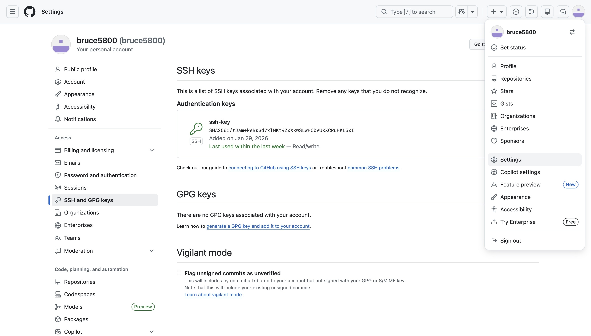

# Git & GitHub 配置说明文档

## 1. 前提条件

- 已安装 Git  
  - Mac / Linux: 运行 `git --version` 检查  
  - Windows: [Git 官方下载](https://git-scm.com/downloads)
- 已有 GitHub 账号
- 已创建或被邀请加入仓库：https://github.com/UoB-COMSM0166/2026-group-23

---

## 2. 配置 SSH Key（推荐方式）

### 2.1 检查本机是否已有 SSH Key

```bash
ls -al ~/.ssh
```

如果存在 id_ed25519 或 id_rsa，可直接使用；否则新建：

```bash
ssh-keygen -t ed25519 -C "你的邮箱@example.com"
```

一路回车即可，passphrase可留空。

### 2.2 添加 SSH Key 到 GitHub
1.	查看公钥内容：
```bash
cat ~/.ssh/id_ed25519.pub
```
2.	打开 GitHub → Settings → SSH and GPG keys → New SSH key

3.	粘贴公钥内容 → 保存

### 2.3 测试 SSH 连接

```bash
ssh -T git@github.com
```

如果出现：

Hi <你的用户名>! You've successfully authenticated, but GitHub does not provide shell access.

说明 SSH 配置完成。


## 3. 配置本地 Git 用户信息
```bash
git config --global user.name "你的名字"
git config --global user.email "你的邮箱@example.com"
```
这会记录在每次提交中，方便团队协作。

## 4. 克隆仓库

使用 SSH 地址：
```bash
git clone git@github.com:UoB-COMSM0166/2026-group-23.git
```
确认远程地址：
```bash
git remote -v
```
输出应类似：

origin  git@github.com:UoB-COMSM0166/2026-group-23.git (fetch)

origin  git@github.com:UoB-COMSM0166/2026-group-23.git (push)

## 6. 提交 & 推送步骤(也可用vscode打开项目文件)
1.  添加修改：
```bash
git add .
```
2.	提交：
```bash
git commit -m "描述本次修改内容"
```
3.	推送（第一次 push 新分支）：
```bash
git push -u origin main
```
4.  后续推送：
```bash
git push
```
